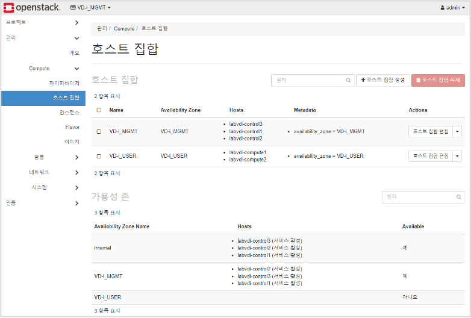

.. image:: media/image1.png
   :width: 2.51217in
   :height: 0.89583in

**Version : 0.1**

**Release : 2022/06/01**

**Writer : 김성진 선임연구원**

**Confirm : 이상석 수석연구원**

+-----------------------------------------------------------------------+
| .. rubric:: **내용**                                                  |
|    :name: 내용                                                        |
|    :class: TOC-Heading                                                |
|                                                                       |
| `1. Openstack - Stein ( Packstack ) <#openstack-stein-packstack>`__   |
| `5 <#openstack-stein-packstack>`__                                    |
|                                                                       |
| `1.1. 구축 - 사내 공용 네트워크 <#구축-사내-공용-네트워크>`__         |
| `5 <#구축-사내-공용-네트워크>`__                                      |
|                                                                       |
| `1.1.1. 기본 요구사항 <#기본-요구사항>`__ `5 <#기본-요구사항>`__      |
|                                                                       |
| `1.1.1.1. 운영체제 <#운영체제>`__ `5 <#운영체제>`__                   |
|                                                                       |
| `1.1.2. 물리 서버 기본 구성 <#물리-서버-기본-구성>`__                 |
| `5 <#물리-서버-기본-구성>`__                                          |
|                                                                       |
| `1.1.2.1. All-in-One <#all-in-one>`__ `5 <#all-in-one>`__             |
|                                                                       |
| `1.1.2.2. Multi-Node <#multi-node>`__ `5 <#multi-node>`__             |
|                                                                       |
| `1.1.3. 가용 Repository 설정 <#가용-repository-설정>`__               |
| `6 <#가용-repository-설정>`__                                         |
|                                                                       |
| `1.1.3.1. Infra openstack : 10.104.61.5 ( Centos7 VM                  |
| ) <#infra-openstack-10.104.61.5-centos7-vm>`__                        |
| `6 <#infra-openstack-10.104.61.5-centos7-vm>`__                       |
|                                                                       |
| `1.1.4. OS 환경 요구사항 <#os-환경-요구사항>`__                       |
| `6 <#os-환경-요구사항>`__                                             |
|                                                                       |
| `1.1.5. Packstack 으로 Openstack                                      |
| 설치 <#packstack-으로-openstack-설치>`__                              |
| `6 <#packstack-으로-openstack-설치>`__                                |
|                                                                       |
| `1.1.5.1. 패키지 설치 <#패키지-설치>`__ `6 <#패키지-설치>`__          |
|                                                                       |
| `1.1.5.2. answer.txt 파일 생성 <#answer.txt-파일-생성>`__             |
| `7 <#answer.txt-파일-생성>`__                                         |
|                                                                       |
| `1.1.5.3. answer.txt 파일 수정 <#answer.txt-파일-수정>`__             |
| `7 <#answer.txt-파일-수정>`__                                         |
|                                                                       |
| `1.1.5.4. packstack 실행 <#packstack-실행>`__ `7 <#packstack-실행>`__ |
|                                                                       |
| `1.1.5.5. 설치 후 옵션 수정 <#설치-후-옵션-수정>`__                   |
| `8 <#설치-후-옵션-수정>`__                                            |
|                                                                       |
| `1.1.6. Ceph Cluster 구성 <#ceph-cluster-구성>`__                     |
| `8 <#ceph-cluster-구성>`__                                            |
|                                                                       |
| `1.2. High Availability 구성 <#high-availability-구성>`__             |
| `8 <#high-availability-구성>`__                                       |
|                                                                       |
| `1.2.1. HA 구성도 <#ha-구성도>`__ `8 <#ha-구성도>`__                  |
|                                                                       |
| `1.2.2. HA - Controller 구성 <#ha---controller-구성>`__               |
| `8 <#ha---controller-구성>`__                                         |
|                                                                       |
| `1.2.2.1. Packstack <#packstack>`__ `9 <#packstack>`__                |
|                                                                       |
| `1.2.2.2. Memcached <#memcached>`__ `9 <#memcached>`__                |
|                                                                       |
| `1.2.2.3. Rabbitmq <#rabbitmq-1>`__ `9 <#rabbitmq-1>`__               |
|                                                                       |
| `1.2.2.4. pcs/corosync/pacemaker 설치                                 |
| 구성 <#pcscorosyncpacemaker-설치-구성>`__                             |
| `10 <#pcscorosyncpacemaker-설치-구성>`__                              |
|                                                                       |
| `1.2.2.5. Mariadb Galera Cluster <#mariadb-galera-cluster>`__         |
| `12 <#mariadb-galera-cluster>`__                                      |
|                                                                       |
| `1.2.2.6. Openstack API HAProxy <#openstack-api-haproxy>`__           |
| `14 <#openstack-api-haproxy>`__                                       |
|                                                                       |
| `1.2.3. HA - Network 구성 <#ha---network-구성>`__                     |
| `18 <#ha---network-구성>`__                                           |
|                                                                       |
| `1.2.3.1. Configuring Layer 3 high availability                       |
| (HA) <#configuring-layer-3-high-availability-ha>`__                   |
| `18 <#configuring-layer-3-high-availability-ha>`__                    |
|                                                                       |
| `1.2.3.2. L3 HA 구성 검증 <#l3-ha-구성-검증>`__                       |
| `19 <#l3-ha-구성-검증>`__                                             |
|                                                                       |
| `1.2.3.3. High-availability for DHCP <#high-availability-for-dhcp>`__ |
| `19 <#high-availability-for-dhcp>`__                                  |
|                                                                       |
| `1.2.3.4. High-availability for                                       |
| LBaasV2 <#high-availability-for-lbaasv2>`__                           |
| `19 <#high-availability-for-lbaasv2>`__                               |
|                                                                       |
| `1.2.3.5. Nova-Compute Evacute <#nova-compute-evacute>`__             |
| `20 <#nova-compute-evacute>`__                                        |
|                                                                       |
| `1.3. Openstack(Stein) Tuning for                                     |
| VD-i <#openstackstein-tuning-for-vd-i>`__                             |
| `20 <#openstackstein-tuning-for-vd-i>`__                              |
|                                                                       |
| `1.3.1. 성능 최적화 참고자료 <#성능-최적화-참고자료>`__               |
| `20 <#성능-최적화-참고자료>`__                                        |
|                                                                       |
| `1.3.2. Openstack 실적용 튜닝 옵션 <#openstack-실적용-튜닝-옵션>`__   |
| `21 <#openstack-실적용-튜닝-옵션>`__                                  |
|                                                                       |
| `1.3.3. 기타 튜닝 - BIOS, OS, RAID 등 <#기타-튜닝-bios-os-raid-등>`__ |
| `22 <#기타-튜닝-bios-os-raid-등>`__                                   |
|                                                                       |
| `1.4. Troubole Shooting <#troubole-shootingstein>`__                  |
| `22 <#troubole-shootingstein>`__                                      |
|                                                                       |
| `2. Openstack - Wallaby ( Kolla-Ansible                               |
| ) <#openstack-wallaby-kolla-ansible>`__                               |
| `22 <#openstack-wallaby-kolla-ansible>`__                             |
|                                                                       |
| `2.1. 기본요구사항 <#기본요구사항>`__ `22 <#기본요구사항>`__          |
|                                                                       |
| `2.1.1. 운영체제 <#운영체제-1>`__ `22 <#운영체제-1>`__                |
|                                                                       |
| `2.1.2. Openstack <#openstack>`__ `23 <#openstack>`__                 |
|                                                                       |
| `2.1.3. Kolla-ansible <#kolla-ansible>`__ `23 <#kolla-ansible>`__     |
|                                                                       |
| `2.2. 사전준비 <#사전준비>`__ `23 <#사전준비>`__                      |
|                                                                       |
| `2.2.1. Bond 인터페이스 구성 <#bond-인터페이스-구성>`__               |
| `23 <#bond-인터페이스-구성>`__                                        |
|                                                                       |
| `2.2.2. OS 환경 설정 <#os-환경-설정>`__ `23 <#os-환경-설정>`__        |
|                                                                       |
| `2.2.3. 배포 서버의 공개키 배포 <#배포-서버의-공개키-배포>`__         |
| `24 <#배포-서버의-공개키-배포>`__                                     |
|                                                                       |
| `2.3. 물리서버 구성 <#물리서버-구성>`__ `24 <#물리서버-구성>`__       |
|                                                                       |
| `2.4. Deploy 서버 구성 <#deploy-서버-구성>`__                         |
| `24 <#deploy-서버-구성>`__                                            |
|                                                                       |
| `2.4.1. Kolla-Ansible 설치 <#kolla-ansible-설치>`__                   |
| `25 <#kolla-ansible-설치>`__                                          |
|                                                                       |
| `2.4.2. Inventory 파일 수정 <#inventory-파일-수정>`__                 |
| `25 <#inventory-파일-수정>`__                                         |
|                                                                       |
| `2.4.3. passwords.yml 생성 <#passwords.yml-생성>`__                   |
| `26 <#passwords.yml-생성>`__                                          |
|                                                                       |
| `2.4.4. Octavia 인증서 생성 <#octavia-인증서-생성>`__                 |
| `26 <#octavia-인증서-생성>`__                                         |
|                                                                       |
| `2.4.5. globals.yml 구성 <#globals.yml-구성>`__                       |
| `27 <#globals.yml-구성>`__                                            |
|                                                                       |
| `2.4.6. OverCloud 필수 패키지 배포 <#overcloud-필수-패키지-배포>`__   |
| `28 <#overcloud-필수-패키지-배포>`__                                  |
|                                                                       |
| `2.4.7. Ceph Cluster 구성 <#ceph-cluster-구성-1>`__                   |
| `28 <#ceph-cluster-구성-1>`__                                         |
|                                                                       |
| `2.4.7.1. Cephadm 패키지 설치 및 Ceph Cluster                         |
| 배포 <#cephadm-패키지-설치-및-ceph-cluster-배포>`__                   |
| `28 <#cephadm-패키지-설치-및-ceph-cluster-배포>`__                    |
|                                                                       |
| `2.4.7.2. Ceph OSD 생성 <#ceph-osd-생성>`__ `29 <#ceph-osd-생성>`__   |
|                                                                       |
| `2.4.7.3. Ceph Pool 생성 <#ceph-pool-생성>`__                         |
| `30 <#ceph-pool-생성>`__                                              |
|                                                                       |
| `2.4.7.4. Ceph Pool Keyring 생성 및 Deploy 노드로                     |
| 복사 <#ceph-pool-keyring-생성-및-deploy-노드로-복사>`__               |
| `30 <#ceph-pool-keyring-생성-및-deploy-노드로-복사>`__                |
|                                                                       |
| `2.4.7.5. glance.conf 생성 <#glance.conf-생성>`__                     |
| `31 <#glance.conf-생성>`__                                            |
|                                                                       |
| `2.5. Kolla-Ansible Openstack container                               |
| 배포 <#kolla-ansible-openstack-container-배포>`__                     |
| `31 <#kolla-ansible-openstack-container-배포>`__                      |
|                                                                       |
| `2.6. Openstack CLI 설치 <#openstack-cli-설치>`__                     |
| `31 <#openstack-cli-설치>`__                                          |
|                                                                       |
| `2.7. Octavia 로드밸런서 구성 <#octavia-로드밸런서-구성>`__           |
| `32 <#octavia-로드밸런서-구성>`__                                     |
|                                                                       |
| `2.7.1. Amphora 이미지 <#amphora-이미지>`__ `32 <#amphora-이미지>`__  |
|                                                                       |
| `2.7.2. Amphora 인스턴스 라우팅                                       |
| 설정 <#amphora-인스턴스-라우팅-설정>`__                               |
| `32 <#amphora-인스턴스-라우팅-설정>`__                                |
|                                                                       |
| `2.7.3. 로드밸런서 생성 <#로드밸런서-생성>`__                         |
| `33 <#로드밸런서-생성>`__                                             |
|                                                                       |
| `2.7.4. 리스너 생성 <#리스너-생성>`__ `33 <#리스너-생성>`__           |
|                                                                       |
| `2.7.5. 멤버 추가 <#멤버-추가>`__ `33 <#멤버-추가>`__                 |
|                                                                       |
| `2.7.6. 상태모니터 생성 <#상태모니터-생성>`__                         |
| `33 <#상태모니터-생성>`__                                             |
|                                                                       |
| `3. Openstack Configuration <#openstack-configuration>`__             |
| `34 <#openstack-configuration>`__                                     |
|                                                                       |
| `3.1. Project 생성 <#project-생성>`__ `34 <#project-생성>`__          |
|                                                                       |
| `3.2. Network 설정 <#network-설정>`__ `36 <#network-설정>`__          |
|                                                                       |
| `3.2.1. Public 네트워크 설정 <#public-네트워크-설정>`__               |
| `36 <#public-네트워크-설정>`__                                        |
|                                                                       |
| `3.2.2. Private 네트워크 설정 <#private-네트워크-설정>`__             |
| `38 <#private-네트워크-설정>`__                                       |
|                                                                       |
| `3.2.2.1. SNAT 활성화 <#snat-활성화>`__ `38 <#snat-활성화>`__         |
|                                                                       |
| `3.2.2.2. SNAT 비활성화 <#snat-비활성화>`__ `39 <#snat-비활성화>`__   |
|                                                                       |
| `3.3. Compute Flavor 구성 <#compute-flavor-구성>`__                   |
| `43 <#compute-flavor-구성>`__                                         |
|                                                                       |
| `3.4. Glance Image 업로드 <#glance-image-업로드>`__                   |
| `44 <#glance-image-업로드>`__                                         |
|                                                                       |
| `3.5. (Multi-Node) 호스트집합 <#multi-node-호스트집합>`__             |
| `45 <#multi-node-호스트집합>`__                                       |
|                                                                       |
| `3.6 인스턴스 생성 <#인스턴스-생성>`__ `46 <#인스턴스-생성>`__        |
|                                                                       |
| `4. VD-i <#vd-i>`__ `46 <#vd-i>`__                                    |
|                                                                       |
| `4.1. VD-i 인프라 구성도 <#vd-i-인프라-구성도>`__                     |
| `46 <#vd-i-인프라-구성도>`__                                          |
|                                                                       |
| `4.2. VD-i 데이터 흐름도 <#vd-i-데이터-흐름도>`__                     |
| `47 <#vd-i-데이터-흐름도>`__                                          |
|                                                                       |
| `4.3. 사전 작업 <#사전-작업>`__ `47 <#사전-작업>`__                   |
|                                                                       |
| `4.4. VD-i 인프라 구축 <#vd-i-인프라-구축>`__                         |
| `47 <#vd-i-인프라-구축>`__                                            |
|                                                                       |
| `4.4.1. VD-i 브로커 <#vd-i-브로커>`__ `47 <#vd-i-브로커>`__           |
|                                                                       |
| `4.4.1.1. 운영체재 <#운영체재>`__ `47 <#운영체재>`__                  |
|                                                                       |
| `4.4.1.2. 필수 패키지 설치 <#필수-패키지-설치>`__                     |
| `47 <#필수-패키지-설치>`__                                            |
|                                                                       |
| `4.4.1.3. Debian 패키지로 설치하기 <#debian-패키지로-설치하기>`__     |
| `47 <#debian-패키지로-설치하기>`__                                    |
|                                                                       |
| `4.4.1.4. Nginx 설정 <#nginx-설정>`__ `48 <#nginx-설정>`__            |
|                                                                       |
| `4.4.1.5. HAProxy 설정 <#haproxy-설정>`__ `51 <#haproxy-설정>`__      |
|                                                                       |
| `4.4.1.6. Mbroker 설치 <#mbroker-설치>`__ `52 <#mbroker-설치>`__      |
|                                                                       |
| `4.4.1.7. VSMGMT 설치 <#vsmgmt-설치>`__ `53 <#vsmgmt-설치>`__         |
|                                                                       |
| `4.4.2. VD-i MariaDB <#vd-i-mariadb>`__ `53 <#vd-i-mariadb>`__        |
|                                                                       |
| `4.4.2.1. 운영체재 <#운영체재-1>`__ `53 <#운영체재-1>`__              |
|                                                                       |
| `4.4.3. VD-i VSMetric <#vd-i-vsmetric>`__ `53 <#vd-i-vsmetric>`__     |
+=======================================================================+
+-----------------------------------------------------------------------+

**History**

+--------+------+--------------------------------------+--------------+
| Date   | Revi | Description                          | Author       |
|        | sion |                                      |              |
+========+======+======================================+==============+
| 2022   | 0.1  | 초안 작성 시작                       | 김성진       |
| -05-23 |      |                                      | 선임연구원   |
+--------+------+--------------------------------------+--------------+
|        |      |                                      |              |
+--------+------+--------------------------------------+--------------+

1. .. rubric:: **Openstack - Stein ( Packstack )**
      :name: openstack-stein-packstack

   1. .. rubric:: **구축 - 사내 공용 네트워크**
         :name: 구축-사내-공용-네트워크

      1. .. rubric:: **기본 요구사항**
            :name: 기본-요구사항

         1. .. rubric:: 운영체제
               :name: 운영체제

-  Version : CentOS 7.9.2009

-  Kernel : 3.10.0-1160.25.1.el7.x86_64

   1. .. rubric:: **물리 서버 기본 구성**
         :name: 물리-서버-기본-구성

      1. .. rubric:: All-in-One
            :name: all-in-one

..

   .. image:: media/image2.png
      :width: 4.35833in
      :height: 2.65in

Multi-Node
==========

.. image:: media/image3.png
   :width: 6.69072in
   :height: 2.69167in

2. .. rubric:: **가용 Repository 설정**
      :name: 가용-repository-설정

   1. .. rubric:: Infra openstack : 10.104.61.5 ( Centos7 VM )
         :name: infra-openstack-10.104.61.5-centos7-vm

-  | sftp 로 접속하여 아래의 파일을 /root/ 로 가져온다.
   | set_vdi_repo.sh
   | wget-1.14-18.el7_6.1.x86_64.rpm

-  wget 설치 이후 set_vdi_repo.sh 를 실행하면 10.104.61.5 로
   리포지토리가 10.104.61.5로 설정된다.

   1. .. rubric:: **OS 환경 요구사항**
         :name: os-환경-요구사항

-  Packstack 설치 배포를 위해서 방화벽 설정 및 파일 오픈 개수 등의
   설정을 진행한다.

+-----------------------------------------------------------------------+
| # Packstack 은 최신 leatherman 패키지로 동작을 안하기 때문에          |
| 다운그레이드 진행                                                     |
|                                                                       |
| # 목표 패키지 버전 : leatherman-1.3.0-9.el7.x86_64                    |
|                                                                       |
| **~# yum downgrade -y leatherman**                                    |
|                                                                       |
| # 설치작업에 방해되므로 firewalld 와 selinux 비활성화                 |
|                                                                       |
| # Openstack 환경은 NetworkManager 를 사용하지 않으므로 비활성화       |
|                                                                       |
| **~# systemctl disable firewalld NetworkManager**                     |
|                                                                       |
| **~# systemctl stop firewalld NetworkManager**                        |
|                                                                       |
| # 임시적용위해서는 setenforce 영구 적용위해서는 /etc/selinux/config   |
| 파일 수정                                                             |
|                                                                       |
| **~# setenforce 0**                                                   |
|                                                                       |
| **~# sed -i ‘s/ SELINUX=enforcing/SELINUX=disabled/’                  |
| /etc/selinux/config**                                                 |
|                                                                       |
| # OS의 파일 오픈 개수 조정                                            |
|                                                                       |
| **~# vim /etc/security/limits.conf**                                  |
|                                                                       |
| root soft nofile 65535                                                |
|                                                                       |
| root hard nofile 65535                                                |
|                                                                       |
| \* soft nproc unlimited                                               |
|                                                                       |
| \* hard nproc unlimited                                               |
|                                                                       |
| \* soft nofile 500000                                                 |
|                                                                       |
| \* hard nofile 500000                                                 |
|                                                                       |
| # 설정 적용을 위해 재부팅                                             |
|                                                                       |
| **~# shutdown -r now**                                                |
+=======================================================================+
+-----------------------------------------------------------------------+

1. .. rubric:: **Packstack 으로 Openstack 설치**
      :name: packstack-으로-openstack-설치

   1. .. rubric:: 패키지 설치
         :name: 패키지-설치

..

   **~# yum install -y openstack-packstack**

answer.txt 파일 생성
====================

   **~# packstack -gen-answer-file=./answer.txt**

answer.txt 파일 수정
====================

+-----------------------------------------------------------------------+
| # 다음의 항목들을 수정한다.                                           |
|                                                                       |
| # (공통) All-in-One / Multi-node                                      |
|                                                                       |
| CONFIG_KEYSTONE_ADMIN_USERNAME=admin                                  |
|                                                                       |
| CONFIG_KEYSTONE_ADMIN_PW=\ **오픈스택 대시보드 패스워드**             |
|                                                                       |
| CONFIG_DEFAULT_PASSWORD=sms980502!                                    |
|                                                                       |
| CONFIG_CONTROLLER_HOST=10.104.102.110                                 |
|                                                                       |
| CONFIG_COMPUTE_HOSTS=10.104.102.110                                   |
|                                                                       |
| CONFIG_NETWORK_HOSTS=10.104.102.110                                   |
|                                                                       |
| CONFIG_MARIADB_PW=sms980502!                                          |
|                                                                       |
| CONFIG_NOVA_SCHED_CPU_ALLOC_RATIO=3.0                                 |
|                                                                       |
| CONFIG_NOVA_SCHED_RAM_ALLOC_RATIO=1.0                                 |
|                                                                       |
| CONFIG_LBAAS_INSTALL=y                                                |
|                                                                       |
| CONFIG_NEUTRON_ML2_TYPE_DRIVERS=flat,vxlan                            |
|                                                                       |
| CONFIG_NEUTRON_ML2_TENANT_NETWORK_TYPES=vxlan                         |
|                                                                       |
| CONFIG_NEUTRON_ML2_MECHANISM_DRIVERS=openvswitch                      |
|                                                                       |
| CONFIG_NEUTRON_OVS_BRIDGE_MAPPINGS=extnet:br-ex                       |
|                                                                       |
| CONFIG_NEUTRON_OVS_BRIDGE_IFACES=br-ex:em1                            |
|                                                                       |
| CONFIG_NEUTRON_OVS_EXTERNAL_PHYSNET=extnet                            |
|                                                                       |
| CONFIG_NEUTRON_OVN_BRIDGE_MAPPINGS=extnet:br-ex                       |
|                                                                       |
| CONFIG_PROVISION_DEMO=n                                               |
|                                                                       |
| # Multinode                                                           |
|                                                                       |
| CONFIG_COMPUTE_HOSTS=10.104.102.16,10.104.102.17                      |
|                                                                       |
| CONFIG_NETWORK_HOSTS=10.104.102.13,10.104.102.14,10.104.102.15        |
|                                                                       |
| CONFIG_NEUTRON_OVS_BRIDGE_MAPPINGS=extnet:br-ex,physnet10:br-port     |
|                                                                       |
| CONFIG_NEUTRON_OVS_BRIDGE_IFACES=br-ex:bond1,br-port:bond10           |
|                                                                       |
| CONFIG_NEUTRON_OVS_BRIDGES_COMPUTE=br-port                            |
|                                                                       |
| CONFIG_NEUTRON_OVS_EXTERNAL_PHYSNET=extnet                            |
|                                                                       |
| CONFIG_NEUTRON_OVS_TUNNEL_IF=bond10                                   |
|                                                                       |
| CONFIG_NEUTRON_OVS_TUNNEL_SUBNETS=192.168.10.0/24                     |
|                                                                       |
| CONFIG_NEUTRON_OVS_VXLAN_UDP_PORT=4789                                |
|                                                                       |
| CONFIG_NEUTRON_OVN_BRIDGE_MAPPINGS=extnet:br-ex                       |
+=======================================================================+
+-----------------------------------------------------------------------+

packstack 실행
==============

   **~# packstack -answer-file=./answer.txt**

.. image:: media/image4.png
   :width: 6.51667in
   :height: 1.175in

설치 후 옵션 수정
=================

   설치 완료된 이후 서비스들의 기본값으로는 사용이 불가하므로 아래와
   같이 조정한다.

Rabbitmq
--------

~# vim /usr/lib/systemd/system/rabbitmq-server.service

+-----------------------------------------------------------------------+
| [Service]                                                             |
|                                                                       |
| LimitNOFILE=16384                                                     |
+=======================================================================+
+-----------------------------------------------------------------------+

Mariadb
-------

~# vim /usr/lib/systemd/system/mariadb.service

+-----------------------------------------------------------------------+
| [Service]                                                             |
|                                                                       |
| LimitNOFILE=infinity                                                  |
|                                                                       |
| LimitMEMLOCK=infinity                                                 |
+=======================================================================+
+-----------------------------------------------------------------------+

**Ceph Cluster 구성**
=====================

1. .. rubric:: **High Availability 구성**
      :name: high-availability-구성

   1. .. rubric:: **HA 구성도**
         :name: ha-구성도

..

   .. image:: media/image5.png
      :width: 6.53333in
      :height: 2.19167in

**HA - Controller 구성**
========================

-  컨트롤러 HA는 두대의 컨트롤러 노드가 동일한 Conf 파일을 가지고 동일한
   MariaDB 를 바라보며 오픈스택 서비스를 구동하고 pcsd 로 클러스터링하여
   생성한 VIP를 가지고 Active-Stanby 형식으로 동작한다.

-  성능과 안정성에 주의를 요하는 MariaDB, Rabbitmq, Keystone, Nova,
   Cinder, Neutron 의 주요서비스의 Endpoint 및 API 는 네트워크 노드에
   별도 구성한 VIP와 HAPROXY 를 통하여 HA 환경을 구성한다.

-  **(반성) pcs/corosync/pacemaker 는 서비스 데몬 상태를 모니터링하고
   제어 등을 수행할 수 있었는데 현재는 VIP 생성용도로만 쓰고 있어서
   차라리 keepalived 만 올리는게 더 가벼울 거 같다.**

   1. .. rubric:: Packstack
         :name: packstack

-  | 먼저 설치한 Controller 노드(이하 Control1)에서 answer.txt 파일을
     복사하고 기존 설치된
   | 호스트 들을 EXCLUDE_SERVERS에 등록하고 Control1의 IP를 Control2
     IP로 수정한다.

+-----------------------------------------------------------------------+
| EXCLUDE_SERVERS={먼저 설치한 모든 HOST_IP}                               |
|                                                                       |
| CONFIG_CONTROLLER_HOST={추가한 컨트롤러 IP}                             |
+=======================================================================+
+-----------------------------------------------------------------------+

-  | 수정한 answer.txt 파일로 packstack 을 실행하여 Control2 를
     설치한다.
   | **~# packstack -answer-file=./answer.txt**

   1. .. rubric:: Memcached
         :name: memcached

+------+----------------+------------------------------+--------------+
| Ser  | File           | Parameters                   | Description  |
| vice |                |                              |              |
+======+================+==============================+==============+
| Keys | /etc/keystone  | [cache]                      | 다중화된     |
| tone | /keystone.conf |                              | 컨트롤러에서 |
|      |                | backend =                    | 캐시를       |
|      |                | oslo_cache.memcache_pool     | 공유하여     |
|      |                |                              | 인증정보를   |
|      |                | enabled = True               | 공유한다.    |
|      |                |                              | 이렇게하면   |
|      |                | memcache_servers =           | 401에러를    |
|      |                | 10.10                        | 대부분 없앨  |
|      |                | .20.11:11211,101020.11:11211 | 수 있다.     |
+------+----------------+------------------------------+--------------+
| Nova | /etc/          | memcache_servers=10.104.71   | -            |
|      | nova/nova.conf | .11:11211,10.104.71.12:11211 |              |
| Neu  |                |                              |              |
| tron | /et            |                              |              |
|      | c/neutron/meta |                              |              |
|      | data_agent.ini |                              |              |
+------+----------------+------------------------------+--------------+
| Neu  | /etc/neutro    | memcached_servers=10.104.71  | -            |
| tron | n/neutron.conf | .11:11211,10.104.71.12:11211 |              |
|      |                |                              |              |
| Ci   | /etc/cind      |                              |              |
| nder | er/cinder.conf |                              |              |
|      |                |                              |              |
| Gl   | /etc/glance/g  |                              |              |
| ance | lance-api.conf |                              |              |
|      |                |                              |              |
|      | /etc           |                              |              |
|      | /glance/glance |                              |              |
|      | -registry.conf |                              |              |
+------+----------------+------------------------------+--------------+

2. .. rubric:: Rabbitmq
      :name: rabbitmq-1

   1. .. rubric:: Rabbitmq-server HA 구성
         :name: rabbitmq-server-ha-구성

-  Rabbitmq 서비스를 중지하고 첫번째 노드에서 쿠키를 다른 노드에
   복사한다.

+-----------------------------------------------------------------------+
| ~# scp /var/lib/rabbitmq/.erlang.cookie                               |
| root@control2:/var/lib/rabbitmq/.erlang.cookie                        |
+=======================================================================+
+-----------------------------------------------------------------------+

-  복사한 각각의 노드에서 erlang.cookie 파일의 권한을 맞춰준다.

+-----------------------------------------------------------------------+
| ~# chown rabbitmq:rabbitmq /var/lib/rabbitmq/.erlang.cookie           |
|                                                                       |
| ~# chmod 400 /var/lib/rabbitmq/.erlang.cookie                         |
+=======================================================================+
+-----------------------------------------------------------------------+

-  모든 노드에서 rabbitmq-server 서비스를 시작/활성화 시킨다.

+-----------------------------------------------------------------------+
| ~# systemctl enable rabbitmq-server.service                           |
|                                                                       |
| ~# systemctl start rabbitmq-server.service                            |
+=======================================================================+
+-----------------------------------------------------------------------+

-  첫번째 노드를 제외한 다른 노드에서 첫번째노드로 클러스터 가입을
   시킨다.

+-----------------------------------------------------------------------+
| ~# rabbitmqctl stop_app                                               |
|                                                                       |
| Stopping node rabbit@NODE... ...done.                                 |
|                                                                       |
| ~# rabbitmqtl join_cluster -ram rabbit@control1                       |
|                                                                       |
| ~# rabbitmqctl start_app                                              |
|                                                                       |
| Starting node rabbit@NODE ... ...done.                                |
+=======================================================================+
+-----------------------------------------------------------------------+

-  클러스터 상태 확인

+-----------------------------------------------------------------------+
| [root@control1 ~]# rabbitmqctl cluster_status                         |
|                                                                       |
| Cluster status of node rabbit@control1                                |
|                                                                       |
| [{nodes,[{disc,[rabbit@control1,rabbit@control2]}]},                  |
|                                                                       |
| {running_nodes,[rabbit@control2,rabbit@control1]},                    |
|                                                                       |
| {cluster_name,<<"rabbit@control2">>},                                 |
|                                                                       |
| {partitions,[]},                                                      |
|                                                                       |
| {alarms,[{rabbit@control2,[]},{rabbit@control1,[]}]}]                 |
+=======================================================================+
+-----------------------------------------------------------------------+

-  큐 대기열을 미러링 시켜서 ha 구성을 하기 위해서 정책을 만들어준다.

+-----------------------------------------------------------------------+
| ~# rabbitmqctl set_policy ha-all '^(?!amq\\.).*' '{"ha-mode": "all"}' |
+=======================================================================+
+-----------------------------------------------------------------------+

Openstack Rabbitmq Durable Queue
--------------------------------

-  세션이 연결된 기존 rabbitmq가 끝나는 경우 미러된 큐로 Failover 하려면
   아래 옵션을 설정한다.

-  **(주의) 이걸 쓰려면 모든 서비스에 이 옵션이 켜져야한다**

+-----------------------------------------------------------------------+
| # All of Openstack Service Conf                                       |
|                                                                       |
| [oslo_messaging_rabbit]                                               |
|                                                                       |
| amqp_durable_queues = true                                            |
+=======================================================================+
+-----------------------------------------------------------------------+

-  | 단, 해당 옵션 적용 뒤에는 적용 전에 생성된 큐가 하나라도 있을 경우
     에러가 발생하므로
   | 모든 큐를 제거해주어야 한다.

+-----------------------------------------------------------------------+
| ~# rabbitmqctl stop_app                                               |
|                                                                       |
| ~# rabbitmqctl reset 기존 생성한 클러스터링 설정도 날라간다           |
+=======================================================================+
+-----------------------------------------------------------------------+

pcs/corosync/pacemaker 설치 구성
--------------------------------

+-----------------------------------------------------------------------+
| **# (공통) Control1, Control2**                                       |
|                                                                       |
| **yum install -y pcs fence-agents-all**                               |
|                                                                       |
| **passwd hacluster # pcs 데몬에서 사용할 hacluster 계정 패스워드      |
| 설정**                                                                |
|                                                                       |
| **systemctl start pcsd.service**                                      |
|                                                                       |
| **systemctl enable pcsd.service**                                     |
|                                                                       |
| **pcs cluster auth control1 control2**                                |
|                                                                       |
| **systemctl enable pacemaker corosync**                               |
|                                                                       |
| **systemctl start pacemaker corosync**                                |
|                                                                       |
| **# Control1 (Master)**                                               |
|                                                                       |
| **pcs cluster setup --start --name openstack control1 control2**      |
|                                                                       |
| **pcs status # 클러스터 상태 확인**                                   |
|                                                                       |
| **pcs cluster start --all**                                           |
|                                                                       |
| **pcs cluster start**                                                 |
|                                                                       |
| **pcs property set stonith-enabled=false; crm_verify -L -V**          |
|                                                                       |
| **# Control2 (Slave)**                                                |
|                                                                       |
| **pcs property set stonith-enabled=false; crm_verify -L -V**          |
+=======================================================================+
+-----------------------------------------------------------------------+

-  `오류! 하이퍼링크 참조가 잘못되었습니다. <>`__

..

   Username : hacluster

   .. image:: media/image6.png
      :alt: 텍스트, 스크린샷, 모니터이(가) 표시된 사진 자동 생성된 설명
      :width: 5.52538in
      :height: 1.89371in

   .. image:: media/image7.png
      :width: 5.71441in
      :height: 2.92878in

   .. image:: media/image8.png
      :alt: 테이블이(가) 표시된 사진 자동 생성된 설명
      :width: 3.58885in
      :height: 6.18413in

Mariadb Galera Cluster
----------------------

-  Mariadb 를 클러스터링해서 다중화 구성을 위해 galera cluster 를
   사용한다.

-  Qurum 방식으로 노드를 늘려나가기 때문에 홀수로 구성

-  **!!! 주의 : 클러스터링된 노드들 중에서 하나의 노드로만 IO를
   수행해야한다
   따라서, haproxy 로 active-backup-backup 구성이 반강제된다.**

   1. .. rubric:: Configuration
         :name: configuration

-  | Packstack 으로 설치할 경우 /etc/my.cnf.d/server.cnf 에 wsrep 옵션이
     활성화 되어있다.
   | 이걸 주석 처리해주고 galera.cnf 를 수정한다.

+-----------------------------------------------------------------------+
| **# /etc/my.cnf.d/server.cnf**                                        |
|                                                                       |
| #wsrep_cluster_name = galera_cluster                                  |
|                                                                       |
| #wsrep_provider = none                                                |
|                                                                       |
| #wsrep_sst_auth = root:                                               |
|                                                                       |
| #wsrep_sst_method = rsync                                             |
+=======================================================================+
| **# /etc/my.cnf.d/galera.cnf**                                        |
|                                                                       |
| [mysqld]                                                              |
|                                                                       |
| binlog_format=ROW                                                     |
|                                                                       |
| default-storage-engine=innodb                                         |
|                                                                       |
| innodb_autoinc_lock_mode=2                                            |
|                                                                       |
| bind-address=0.0.0.0                                                  |
|                                                                       |
| wsrep_on=ON                                                           |
|                                                                       |
| wsrep_provider=/usr/lib64/galera/libgalera_smm.so                     |
|                                                                       |
| **wsrep_cluster_name="svdi-galeracluster"**                           |
|                                                                       |
| **wsr                                                                 |
| ep_cluster_address="gcomm://10.104.71.11,10.104.71.12,10.104.71.13"** |
|                                                                       |
| **wsrep_node_name=svdi-controller1**                                  |
|                                                                       |
| **wsrep_node_address=10.104.71.11**                                   |
|                                                                       |
| wsrep_slave_threads=1                                                 |
|                                                                       |
| wsrep_certify_nonPK=1                                                 |
|                                                                       |
| wsrep_max_ws_rows=131072                                              |
|                                                                       |
| wsrep_max_ws_size=1073741824                                          |
|                                                                       |
| wsrep_debug=0                                                         |
|                                                                       |
| wsrep_convert_LOCK_to_trx=0                                           |
|                                                                       |
| wsrep_retry_autocommit=10                                             |
|                                                                       |
| wsrep_auto_increment_control=1                                        |
|                                                                       |
| wsrep_drupal_282555_workaround=0                                      |
|                                                                       |
| wsrep_causal_reads=0                                                  |
|                                                                       |
| wsrep_notify_cmd=                                                     |
|                                                                       |
| wsrep_sst_method=rsync                                                |
|                                                                       |
| **wsrep_sst_auth=root:sms980502!**                                    |
|                                                                       |
| innodb_buffer_pool_size=8G                                            |
|                                                                       |
| innodb_buffer_pool_instances=4                                        |
+-----------------------------------------------------------------------+

-  | 3대의 mariadb를 설정한 뒤에 1대에서 먼저 아래의 명령을 실행한다.
   | ~# galera_new_cluster

-  | 나머지 2대에서는 아래와 같이 서비스를 실행한다.
   | ~# systemctl start mariadb

   1. .. rubric:: Galera Cluster 상태 점검
         :name: galera-cluster-상태-점검

-  아래의 명령으로 Galera Cluster에 노드가 묶인 것을 확인할 수 있다.

+-----------------------------------------------------------------------+
| [root@svdi-controller1 my.cnf.d]# mysql -uroot -e "show status like   |
| 'wsrep_cluster_size';"                                                |
|                                                                       |
| +--------------------+-------+                                        |
|                                                                       |
| \| Variable_name \| Value \|                                          |
|                                                                       |
| +--------------------+-------+                                        |
|                                                                       |
| \| wsrep_cluster_size \| 3 \|                                         |
|                                                                       |
| +--------------------+-------+                                        |
+=======================================================================+
+-----------------------------------------------------------------------+

MariaDB Galera Cluster Recovery
~~~~~~~~~~~~~~~~~~~~~~~~~~~~~~~

-  클러스터링된 장비 3대가 한번에 재부팅 될 경우 자동으로 복구 되지
   않는다.

-  | /var/lib/mysql/grastate.dat 에서 seqno 로 마지막에 살아있는 노드를
     순차적으로 서비스를
   | 기동할수도 있지만 속편한 방법은 그냥 다시 클러스터링을 묶어주는
     것이다.

+-----------------------------------------------------------------------+
| ~# systemctl stop mariadb 오래 걸리는 경우 mysql 프로세스를 찾아서 kill   |
|                                                                       |
| ~# rm -f /var/lib/mysql/grastate.dat                                  |
|                                                                       |
| ~# rm -f /var/lib/mysql/galera.cache                                  |
|                                                                       |
| ~# galera_new_cluster                                                 |
+=======================================================================+
+-----------------------------------------------------------------------+

Openstack API HAProxy
---------------------

   ~# yum install -y keepalived haproxy

-  컨트롤러 HA 구성하고 Openstack API에 대해서 HAPROXY 처리를 해주지
   않으면 VIP를 들고있는 컨트롤러에서 특정 서비스가 죽을 경우 해당
   서비스는 사용할 수가 없다.

-  VD-i 운영에 지장없는 서비스를 제외하고 아래의 서비스만 haproxy에
   등록하여 운영한다.

+-----------------------------------+-----------------------------------+
| Service                           | Port                              |
+===================================+===================================+
| Kestone                           | 5000                              |
+-----------------------------------+-----------------------------------+
| Nova                              | 8774,8778                         |
+-----------------------------------+-----------------------------------+
| Neutron                           | 9696                              |
+-----------------------------------+-----------------------------------+
| Cinder                            | 8776                              |
+-----------------------------------+-----------------------------------+
| Rabbitmq                          | 5672                              |
+-----------------------------------+-----------------------------------+
| MariaDB                           | 3306                              |
+-----------------------------------+-----------------------------------+

-  | MariaDB가 설치 되지 않은 Network 노드 2대에 keepalived, haproxy 를
     설치하여 운영한다.\|
   | (MariaDB가 3306을 열고있는데 haproxy에서 또 3306을 열수 없음. 둘
     중에 하나 포트를 바꿀수는 있지만 그렇게 되면 피곤해진다…….)

   1. .. rubric:: Keepalived Configuration
         :name: keepalived-configuration

+-----------------------------------------------------------------------+
| **#MASTER**                                                           |
|                                                                       |
| **# /etc/keepalived/keepalived.conf**                                 |
|                                                                       |
| global_defs {                                                         |
|                                                                       |
| notification_email {                                                  |
|                                                                       |
| }                                                                     |
|                                                                       |
| smtp_server 127.0.0.1 # You can specifiy your own smtp server here    |
|                                                                       |
| smtp_connect_timeout 15                                               |
|                                                                       |
| }                                                                     |
|                                                                       |
| # Define the script used to check if haproxy is still working         |
|                                                                       |
| **# 3306 포트에 대한 헬스체크를 수행하는 스크립트인데 뭔가            |
| 부실하다..개선하자**                                                  |
|                                                                       |
| **# haproxy 프로세스를 다 죽여버리면 LBaasV2 가 같이                  |
| 죽어버릴수도있다**                                                    |
|                                                                       |
| vrrp_script chk_haproxy {                                             |
|                                                                       |
| #script "killall -0 haproxy"                                          |
|                                                                       |
| script "nc -z 127.0.0.1 3306"                                         |
|                                                                       |
| interval 2                                                            |
|                                                                       |
| weight 2                                                              |
|                                                                       |
| }                                                                     |
|                                                                       |
| # Configuation for the virtual interface                              |
|                                                                       |
| vrrp_instance VI_1 {                                                  |
|                                                                       |
| interface bond0                                                       |
|                                                                       |
| state MASTER                                                          |
|                                                                       |
| priority 101                                                          |
|                                                                       |
| virtual_router_id 51                                                  |
|                                                                       |
| smtp_alert # Activate email notifications                             |
|                                                                       |
| authentication {                                                      |
|                                                                       |
| auth_type PASS                                                        |
|                                                                       |
| auth_pass myPassw0rd # Set this to some secret phrase                 |
|                                                                       |
| }                                                                     |
|                                                                       |
| # The virtual ip address shared between the two loadbalancers         |
|                                                                       |
| virtual_ipaddress {                                                   |
|                                                                       |
| 10.104.102.23                                                         |
|                                                                       |
| }                                                                     |
|                                                                       |
| # Use the script above to check if we should fail over                |
|                                                                       |
| track_script {                                                        |
|                                                                       |
| chk_haproxy                                                           |
|                                                                       |
| }                                                                     |
|                                                                       |
| }                                                                     |
+=======================================================================+
| **#SLAVE**                                                            |
|                                                                       |
| **# /etc/keepalived/keepalived.conf**                                 |
|                                                                       |
| global_defs {                                                         |
|                                                                       |
| notification_email {                                                  |
|                                                                       |
| }                                                                     |
|                                                                       |
| smtp_server 127.0.0.1 # You can specifiy your own smtp server here    |
|                                                                       |
| smtp_connect_timeout 15                                               |
|                                                                       |
| }                                                                     |
|                                                                       |
| # Define the script used to check if haproxy is still working         |
|                                                                       |
| vrrp_script chk_haproxy {                                             |
|                                                                       |
| #script "killall -0 haproxy"                                          |
|                                                                       |
| script "nc -z 127.0.0.1 3306"                                         |
|                                                                       |
| interval 2                                                            |
|                                                                       |
| weight 2                                                              |
|                                                                       |
| }                                                                     |
|                                                                       |
| # Configuation for the virtual interface                              |
|                                                                       |
| vrrp_instance VI_1 {                                                  |
|                                                                       |
| interface bond0                                                       |
|                                                                       |
| state BACKUP                                                          |
|                                                                       |
| priority 102                                                          |
|                                                                       |
| virtual_router_id 51                                                  |
|                                                                       |
| smtp_alert # Activate email notifications                             |
|                                                                       |
| authentication {                                                      |
|                                                                       |
| auth_type PASS                                                        |
|                                                                       |
| auth_pass myPassw0rd # Set this to some secret phrase                 |
|                                                                       |
| }                                                                     |
|                                                                       |
| # The virtual ip address shared between the two loadbalancers         |
|                                                                       |
| virtual_ipaddress {                                                   |
|                                                                       |
| 10.104.102.23                                                         |
|                                                                       |
| }                                                                     |
|                                                                       |
| # Use the script above to check if we should fail over                |
|                                                                       |
| track_script {                                                        |
|                                                                       |
| chk_haproxy                                                           |
|                                                                       |
| }                                                                     |
|                                                                       |
| }                                                                     |
+-----------------------------------------------------------------------+

Haproxy Configuration
~~~~~~~~~~~~~~~~~~~~~

+-----------------------------------------------------------------------+
| global                                                                |
|                                                                       |
| log 127.0.0.1 local2                                                  |
|                                                                       |
| maxconn 65535                                                         |
|                                                                       |
| user root                                                             |
|                                                                       |
| group root                                                            |
|                                                                       |
| daemon                                                                |
|                                                                       |
| stats socket /var/run/haproxy.sock mode 600 level admin               |
|                                                                       |
| defaults                                                              |
|                                                                       |
| log global                                                            |
|                                                                       |
| option redispatch                                                     |
|                                                                       |
| retries 3                                                             |
|                                                                       |
| timeout http-request 10s                                              |
|                                                                       |
| timeout http-keep-alive 10s                                           |
|                                                                       |
| timeout queue 1m                                                      |
|                                                                       |
| timeout connect 10s                                                   |
|                                                                       |
| timeout client 1m                                                     |
|                                                                       |
| timeout server 1m                                                     |
|                                                                       |
| timeout check 10s                                                     |
|                                                                       |
| balance roundrobin                                                    |
|                                                                       |
| frontend mysql_cluster_frontend                                       |
|                                                                       |
| bind \*:3306                                                          |
|                                                                       |
| mode tcp                                                              |
|                                                                       |
| option clitcpka                                                       |
|                                                                       |
| timeout client 3600s                                                  |
|                                                                       |
| option tcplog                                                         |
|                                                                       |
| default_backend galera_cluster_backend                                |
|                                                                       |
| backend galera_cluster_backend                                        |
|                                                                       |
| mode tcp                                                              |
|                                                                       |
| option tcpka                                                          |
|                                                                       |
| timeout server 3600s                                                  |
|                                                                       |
| balance roundrobin                                                    |
|                                                                       |
| server control1 10.104.102.14:3306 check backup                       |
|                                                                       |
| server control2 10.104.102.15:3306 check weight 1                     |
|                                                                       |
| server network1 10.104.102.13:3306 check backup                       |
|                                                                       |
| listen stats 0.0.0.0:9000                                             |
|                                                                       |
| mode http                                                             |
|                                                                       |
| log global                                                            |
|                                                                       |
| stats enable                                                          |
|                                                                       |
| stats refresh 5s                                                      |
|                                                                       |
| stats uri /stats                                                      |
|                                                                       |
| stats realm HAProxy\\ Statistics                                      |
|                                                                       |
| stats auth admin:myPassword                                           |
|                                                                       |
| stats admin if TRUE                                                   |
|                                                                       |
| frontend keystone_front                                               |
|                                                                       |
| mode http                                                             |
|                                                                       |
| http-request del-header X-Forwarded-Proto                             |
|                                                                       |
| option httplog                                                        |
|                                                                       |
| option forwardfor                                                     |
|                                                                       |
| http-request set-header X-Forwarded-Proto https if { ssl_fc }         |
|                                                                       |
| bind \*:5000                                                          |
|                                                                       |
| default_backend keystone_back                                         |
|                                                                       |
| backend keystone_back                                                 |
|                                                                       |
| mode http                                                             |
|                                                                       |
| balance roundrobin                                                    |
|                                                                       |
| server control1 10.104.102.14:5000 check inter 2000 rise 2 fall 5     |
|                                                                       |
| server control2 10.104.102.15:5000 check inter 2000 rise 2 fall 5     |
|                                                                       |
| frontend neutron_front                                                |
|                                                                       |
| mode http                                                             |
|                                                                       |
| http-request del-header X-Forwarded-Proto                             |
|                                                                       |
| option httplog                                                        |
|                                                                       |
| option forwardfor                                                     |
|                                                                       |
| maxconn 10000                                                         |
|                                                                       |
| http-request set-header X-Forwarded-Proto https if { ssl_fc }         |
|                                                                       |
| bind \*:9696                                                          |
|                                                                       |
| default_backend neutron_back                                          |
|                                                                       |
| backend neutron_back                                                  |
|                                                                       |
| balance roundrobin                                                    |
|                                                                       |
| mode http                                                             |
|                                                                       |
| fullconn 5000                                                         |
|                                                                       |
| server control1 10.104.102.14:9696 check inter 2000 rise 2 fall 5     |
|                                                                       |
| server control2 10.104.102.15:9696 check inter 2000 rise 2 fall 5     |
|                                                                       |
| frontend cinder_front                                                 |
|                                                                       |
| mode http                                                             |
|                                                                       |
| http-request del-header X-Forwarded-Proto                             |
|                                                                       |
| option httplog                                                        |
|                                                                       |
| option forwardfor                                                     |
|                                                                       |
| http-request set-header X-Forwarded-Proto https if { ssl_fc }         |
|                                                                       |
| bind \*:8776                                                          |
|                                                                       |
| default_backend cinder_back                                           |
|                                                                       |
| backend cinder_back                                                   |
|                                                                       |
| mode http                                                             |
|                                                                       |
| server control1 10.104.102.14:8776 check inter 2000 rise 2 fall 5     |
|                                                                       |
| server control2 10.104.102.15:8776 check inter 2000 rise 2 fall 5     |
|                                                                       |
| frontend nova_front                                                   |
|                                                                       |
| mode http                                                             |
|                                                                       |
| http-request del-header X-Forwarded-Proto                             |
|                                                                       |
| option httplog                                                        |
|                                                                       |
| option forwardfor                                                     |
|                                                                       |
| http-request set-header X-Forwarded-Proto https if { ssl_fc }         |
|                                                                       |
| bind \*:8774                                                          |
|                                                                       |
| default_backend nova_back                                             |
|                                                                       |
| backend nova_back                                                     |
|                                                                       |
| mode http                                                             |
|                                                                       |
| balance roundrobin                                                    |
|                                                                       |
| server control1 10.104.102.14:8774 check inter 2000 rise 2 fall 5     |
|                                                                       |
| server control2 10.104.102.15:8774 check inter 2000 rise 2 fall 5     |
|                                                                       |
| frontend nova_placement_front                                         |
|                                                                       |
| mode http                                                             |
|                                                                       |
| http-request del-header X-Forwarded-Proto                             |
|                                                                       |
| option httplog                                                        |
|                                                                       |
| option forwardfor                                                     |
|                                                                       |
| http-request set-header X-Forwarded-Proto https if { ssl_fc }         |
|                                                                       |
| bind \*:8778                                                          |
|                                                                       |
| default_backend nova_placement_back                                   |
|                                                                       |
| backend nova_placement_back                                           |
|                                                                       |
| mode http                                                             |
|                                                                       |
| balance roundrobin                                                    |
|                                                                       |
| server control1 10.104.102.14:8778 check inter 2000 rise 2 fall 5     |
|                                                                       |
| server control2 10.104.102.15:8778 check inter 2000 rise 2 fall 5     |
+=======================================================================+
+-----------------------------------------------------------------------+

**HA - Network 구성**
=====================

-  네트워크 노드의 HA 는 Openstack Neutron의 Failover 기능을 사용한다.

   1. .. rubric:: Configuring Layer 3 high availability (HA)
         :name: configuring-layer-3-high-availability-ha

-  Controller

+-----------------------------------------------------------------------+
| **# /etc/neutron/neutron.conf**                                       |
|                                                                       |
| **[DEFAULT]**                                                         |
|                                                                       |
| **l3_ha = True**                                                      |
|                                                                       |
| **max_l3_agents_per_router = 3**                                      |
|                                                                       |
| **min_l3_agents_per_router = 3**                                      |
+=======================================================================+
| **# /etc/openstack-dashboard/local_settings**                         |
|                                                                       |
| **# line:373**                                                        |
|                                                                       |
| OPENSTACK_NEUTRON_NETWORK = {                                         |
|                                                                       |
| 'enable_distributed_router': False,                                   |
|                                                                       |
| 'enable_firewall': False,                                             |
|                                                                       |
| **'enable_ha_router': True,**                                         |
|                                                                       |
| 'enable_lb': True,                                                    |
|                                                                       |
| 'enable_quotas': True,                                                |
|                                                                       |
| 'enable_security_group': True,                                        |
|                                                                       |
| 'enable_vpn': False,                                                  |
|                                                                       |
| 'profile_support': None,                                              |
|                                                                       |
| }                                                                     |
+-----------------------------------------------------------------------+

L3 HA 구성 검증
---------------

-  네트워크 노드에서 아래의 명령어로 활성화되어서 IP를 들고있는 물리적
   노드를 찾는다.

..

   ~# ip netns

   ~# ip netns exec qrouter-dbecd93b-45c1-4445-a19f-86fd7bafe0b8 ip a

-  | 활성화되어있는 qrouter 에서 ha 포트의 링크를 다운 시키면 자동으로
     다른 물리적 노드의 qrouter 가 IP를 가져오며 활성화된다. Failover 될
     때 네트워크 단절 없이 ping 1개 빠지는 수준이므로 별로 걱정 안해도
     된다.
   | ~# ip netns exec qrouter-dbecd93b-45c1-4445-a19f-86fd7bafe0b8 ip
     link set ha-b32b8df3-9b down

   1. .. rubric:: High-availability for DHCP
         :name: high-availability-for-dhcp

-  Controller

+-----------------------------------------------------------------------+
| **#/etc/neutron/neutron.conf**                                        |
|                                                                       |
| [DEFAULT]                                                             |
|                                                                       |
| dhcp_agents_per_network = 3                                           |
+=======================================================================+
+-----------------------------------------------------------------------+

High-availability for LBaasV2
-----------------------------

-  Controller / Network

+-----------------------------------------------------------------------+
| **# /etc/neutron/neutron_lbaas.conf**                                 |
|                                                                       |
| [DEFAULT]                                                             |
|                                                                       |
| allow_automatic_lbaas_agent_failover=True                             |
+=======================================================================+
+-----------------------------------------------------------------------+

Nova-Compute Evacute
--------------------

1. .. rubric:: **Openstack(Stein) Tuning for VD-i**
      :name: openstackstein-tuning-for-vd-i

   1. .. rubric:: **성능 최적화 참고자료**
         :name: 성능-최적화-참고자료

-  아래의 표는 인텔에서 작성한 “Performance Optimization Study: China
   Railway’s Ultra-large Scale OpenStack\* Industry Cloud Based on
   Intel® Architecture” 의 파라메터 조정 수치이며 VD-i에서 실제 적용된
   항목은 마스킹 되어있다.

+----------------------+----------------------------+-----------------+
| **File**             | **Modified Parameters**    | **Description** |
+======================+============================+=================+
| /usr/l               | LimitNOFILE=65536          | Maximum         |
| ib/system/system/rab |                            | connections of  |
| bitmq-server.service |                            | RabbitMQ        |
|                      |                            | Service         |
+----------------------+----------------------------+-----------------+
| /etc/rabb            | Cl                         | Modified        |
| itmq/rabbitmq.config | uster_partiotion_handling, | RabbitMQ        |
|                      | autoheal                   |                 |
|                      |                            | configuration   |
|                      | vm_memory_high_watermark,  | file            |
|                      | 0.6                        |                 |
|                      |                            |                 |
|                      | co                         |                 |
|                      | llect_statistics_interval, |                 |
|                      | 30000                      |                 |
|                      |                            |                 |
|                      | backlog, 2048              |                 |
+----------------------+----------------------------+-----------------+
| /etc/rabbit          | ulimit -S -n 4096          | RabbitMQ delete |
| mq/rabbitmq-env.conf |                            | line            |
+----------------------+----------------------------+-----------------+
| /usr/lib/system/sy   | LimitNOFILE=65536          | Maximum         |
| stem/mariadb.service |                            | connection of   |
|                      |                            | Mysql service   |
+----------------------+----------------------------+-----------------+
| /etc                 | max_user_connections=10000 | Modified Mysql  |
| /my.cnf.d/server.cnf |                            | configutaion    |
|                      | max_connections=100000     | file            |
|                      |                            |                 |
|                      | table_open_cache = 4096    |                 |
|                      |                            |                 |
|                      | innodb_buffer_pool_size =  |                 |
|                      | 2G                         |                 |
|                      |                            |                 |
|                      | innodb_log_file_size = 192 |                 |
|                      |                            |                 |
|                      | in                         |                 |
|                      | nodb_buffer_pool_instances |                 |
|                      | = 2                        |                 |
|                      |                            |                 |
|                      | wsrep_slave_threads = 48   |                 |
|                      |                            |                 |
|                      | inno                       |                 |
|                      | db_flush_log_at_trx_commit |                 |
|                      | = 0                        |                 |
|                      |                            |                 |
|                      | thread_concurrency = 48    |                 |
|                      |                            |                 |
|                      | thread_cache_size = 32     |                 |
|                      |                            |                 |
|                      | query_cache_type = 0       |                 |
|                      |                            |                 |
|                      | query_cache_size = 0       |                 |
|                      |                            |                 |
|                      | join_buffer_size = 256K    |                 |
|                      |                            |                 |
|                      | innodb                     |                 |
|                      | _checksum_algorithm=innodb |                 |
+----------------------+----------------------------+-----------------+
| /                    | LimitNOFILE=65536          | Maximum number  |
| usr/lib/systemd/syst |                            | of Memcached    |
| em/memcached.service |                            | service         |
|                      |                            | connections     |
+----------------------+----------------------------+-----------------+
| /etc                 | MAXCONN=”65535”            | Modification of |
| /sysconfig/memcached |                            | Memcached       |
|                      | CACHESIZE=”16384”          | configuration   |
|                      |                            | documents       |
|                      | OPTIONS=”-t 16”            |                 |
+----------------------+----------------------------+-----------------+
| /usr/lib/systemd/sy  | LimitNOFILE=65536          | Maximum number  |
| stem/haproxy.service |                            | of Haproxy      |
|                      |                            | service         |
|                      |                            | connections     |
+----------------------+----------------------------+-----------------+
| /etc                 | maxconn=80000              |                 |
| /haproxy/haproxy.cfg |                            |                 |
+----------------------+----------------------------+-----------------+
| /etc                 | listen mq-cluster          | Modification of |
| /haproxy/haproxy.cfg |                            | Haproxy         |
|                      | balance source             | configuration   |
|                      |                            | documents       |
|                      | hash-type consistent       |                 |
|                      |                            |                 |
|                      | mode tcp                   |                 |
|                      |                            |                 |
|                      | option tcplog              |                 |
|                      |                            |                 |
|                      | option clitcpka            |                 |
|                      |                            |                 |
|                      | option srvtcpka            |                 |
|                      |                            |                 |
|                      | timeout client 28801s      |                 |
|                      |                            |                 |
|                      | timeout server 28801s      |                 |
|                      |                            |                 |
|                      | neutron-api-cluster        |                 |
|                      |                            |                 |
|                      | timeout server 600s        |                 |
|                      |                            |                 |
|                      | cinder-api-cluster         |                 |
|                      |                            |                 |
|                      | timeout server 600s        |                 |
+----------------------+----------------------------+-----------------+
| /etc/sysctl.conf     | net.ipv4.neigh             | Modification of |
|                      | .default.gc_thresh1=204800 | the MAC related |
|                      | net.ipv4.neigh             | configuration   |
|                      | .default.gc_thresh1=307200 | part in system  |
|                      | net.ipv4.neigh             | table           |
|                      | .default.gc_thresh1=409600 |                 |
|                      | net.ipv4.ne                |                 |
|                      | igh.default.gc_stale_time= |                 |
|                      | 604800                     |                 |
+----------------------+----------------------------+-----------------+
| /etc/nova/nova.conf  | Ad a configuration item:  | Modification of |
|                      |                            | Nova            |
|                      | blo                        | configuration   |
|                      | ck_device_allocate_retries | documents       |
|                      | = 200                      |                 |
|                      |                            |                 |
|                      | Modify a configuration     |                 |
|                      | item:                     |                 |
|                      |                            |                 |
|                      | rpc_response\_ timeout=600 |                 |
|                      |                            |                 |
|                      | Modify a configuration     |                 |
|                      | item:                     |                 |
|                      |                            |                 |
|                      | Timeout=600([neutron]     |                 |
|                      | module)                   |                 |
+----------------------+----------------------------+-----------------+
| /etc/                | Modify a configuration     | Modification of |
| neutron/neutron.conf | item:api_workers=24       | Neutron         |
|                      |                            | configuration   |
|                      | Modify a configuration     | documents       |
|                      | item:rpc_workers=24       |                 |
+----------------------+----------------------------+-----------------+
| /etc/sysctl.conf     | Add a configuration item:  | Modification of |
|                      | fs.file-max=502400         | system          |
|                      |                            | configuration   |
|                      |                            | documents       |
+----------------------+----------------------------+-----------------+
| /etc/ke              | Add the following          | Modification of |
| ystone/keystone.conf | configurations:            | Keystone        |
|                      |                            | configuration   |
|                      | [memcache]                 | documents       |
|                      |                            |                 |
|                      | servers =                  |                 |
|                      | 172.17.1.250:11211         |                 |
|                      |                            |                 |
|                      | [token]                    |                 |
|                      |                            |                 |
|                      | provider =                 |                 |
|                      | keystone.tok               |                 |
|                      | en.providers.uuid.Provider |                 |
|                      |                            |                 |
|                      | driver =                   |                 |
|                      | keystone.token.persisten   |                 |
|                      | ce.backends.memcache.Token |                 |
+----------------------+----------------------------+-----------------+
| Each OpenStack       | All configuration items    | Delete          |
| component’s          | are deployed as noop       | notification    |
| notification driver  |                            | driver          |
+----------------------+----------------------------+-----------------+
| /pro                 | 80000                      | Modification of |
| c/sys/kernel/pid_max |                            | the maximum     |
|                      |                            | number of       |
|                      |                            | processes       |
+----------------------+----------------------------+-----------------+

**Openstack에 실제 적용한 튜닝 설정**
=====================================

+------+----------------+-----------------------------+---------------+
| Ser  | File           | Parameters                  | Description   |
| vice |                |                             |               |
+======+================+=============================+===============+
| Keys | /etc/keystone  | [cache]                     | 다중화된      |
| tone | /keystone.conf |                             | 컨트롤러에서  |
|      |                | backend =                   | 캐시를        |
|      |                | oslo_cache.memcache_pool    | 공유하여      |
|      |                |                             | 인증정보를    |
|      |                | enabled = True              | 공유한다.     |
|      |                |                             | 이렇게하면    |
|      |                | memcache_servers =          | 401에러를     |
|      |                | 10.10.                      | 대부분 없앨   |
|      |                | 20.11:11211,101020.11:11211 | 수 있다.      |
+------+----------------+-----------------------------+---------------+
| (공  | conf 파일      | [os                         | Rabbitmq 에   |
| 통)  |                | lo_messaging_notifications] | notification  |
|      |                |                             | 드라이버를    |
|      |                | transport_url =             | 제거함으로    |
|      |                | rabbit://open               | 부하를        |
|      |                | stack:passwd@control1:5672, | 줄인다.       |
|      |                | ope                         |               |
|      |                | nstack:passwd@control2:5672 |               |
|      |                |                             |               |
|      |                | driver = noop               |               |
+------+----------------+-----------------------------+---------------+
| (공  | conf 파일      | [DEFAULT]                   | 메시징큐      |
| 통)  |                |                             | 타임아웃      |
|      |                | rpc_response_timeout=600    | 늘리기,       |
|      |                |                             | 기본값 60으로 |
|      |                |                             | 해당 시간내에 |
|      |                |                             | 트랜잭션이    |
|      |                |                             | 종료되지      |
|      |                |                             | 않으면 작업이 |
|      |                |                             | 실패한다.     |
|      |                |                             | 볼륨생성등의  |
|      |                |                             | 오래걸리는    |
|      |                |                             | 작업 경우     |
|      |                |                             | 이것 때문에   |
|      |                |                             | 실패할 수     |
|      |                |                             | 있으므로      |
|      |                |                             | 늘려준다.     |
+------+----------------+-----------------------------+---------------+
| Nova | /etc/          | [DEFAULT]                   | 볼륨 생성에   |
|      | nova/nova.conf |                             | 시간이        |
|      |                | block_                      | 걸리므로      |
|      |                | device_allocate_retries=100 | 인스턴스 생성 |
|      |                |                             | 시에 발생할   |
|      |                | block_device_a              | 실패를        |
|      |                | llocate_retries_interval=10 | 방지하기 위해 |
|      |                |                             | 늘려준다.     |
+------+----------------+-----------------------------+---------------+
| Nova | /etc/          | [DEFAULT]                   | 인스턴스 생성 |
|      | nova/nova.conf |                             | 시 VIF 가     |
|      |                | vif_plugging_is_fatal=false | 연결 완료     |
|      |                |                             | 메시지가      |
|      |                |                             | 없으면        |
|      |                |                             | 인스턴스      |
|      |                |                             | 생성이        |
|      |                |                             | 실패하는데    |
|      |                |                             | 연결안되는    |
|      |                |                             | 경우도 없는데 |
|      |                |                             | 메시지가      |
|      |                |                             | 안와서        |
|      |                |                             | 실패하니 그냥 |
|      |                |                             | 꺼주자        |
+------+----------------+-----------------------------+---------------+
| Nova | /etc/          | [libvirt]                   | iscsi, ceph   |
|      | nova/nova.conf |                             | 같은 네트워크 |
|      |                | disk_cac                    | 연결 기반의   |
|      |                | hemodes="network=writeback" | 볼륨을 사용할 |
|      |                |                             | 때 해당       |
|      |                | cpu_mode=host-passthrough   | 옵션을        |
|      |                |                             | 적용해준다.   |
+------+----------------+-----------------------------+---------------+
| Neu  | /etc/neutro    | # Controller                | neutron-agent |
| tron | n/neutron.conf |                             | 들에 대하여   |
|      |                | agent_down_time=80          | 헬스체크      |
|      |                |                             | 타임아웃      |
|      |                | # Network                   | 설정, L3 같은 |
|      |                |                             | 경우는 즉시   |
|      |                | [agent]                     | Failover 되며 |
|      |                |                             | 이 옵션으로   |
|      |                | report_interval=10          | 제일 영향     |
|      |                |                             | 많은 부분은   |
|      |                |                             | LBaaSV2 로    |
|      |                |                             | 짧아질 수록   |
|      |                |                             | Failover      |
|      |                |                             | 복구가        |
|      |                |                             | 빨라진다.     |
|      |                |                             | 다만 너무     |
|      |                |                             | 줄이면        |
|      |                |                             | 안되므로      |
|      |                |                             | 주의가        |
|      |                |                             | 필요하다.     |
+------+----------------+-----------------------------+---------------+
| (공  | conf 파일      | [database]                  | connection    |
| 통)  |                |                             | _recycle_time |
|      |                | connection_recycle_time =   |               |
|      |                | 10                          | - 이          |
|      |                |                             | 시간(초)보다  |
|      |                | max_pool_size = 1           | 오래 연결     |
|      |                |                             | 풀에 있었던   |
|      |                | max_retries = -1            | 연결은 다음에 |
|      |                |                             | 풀에서        |
|      |                |                             | 체크아웃할 때 |
|      |                |                             | 새 연결로     |
|      |                |                             | 바뀝니다.     |
|      |                |                             |               |
|      |                |                             | max_pool_size |
|      |                |                             |               |
|      |                |                             | - 풀에서 열린 |
|      |                |                             | 상태로 유지할 |
|      |                |                             | 최대 SQL 연결 |
|      |                |                             | 수입니다.     |
|      |                |                             | 값을 0으로    |
|      |                |                             | 설정하면      |
|      |                |                             | 제한이 없음을 |
|      |                |                             | 나타냅니다.   |
|      |                |                             |               |
|      |                |                             | max_retires   |
|      |                |                             |               |
|      |                |                             | - 시작 중     |
|      |                |                             | 최대          |
|      |                |                             | 데이터베이스  |
|      |                |                             | 연결 재시도   |
|      |                |                             | 횟수입니다.   |
|      |                |                             | 무한 재시도   |
|      |                |                             | 횟수를        |
|      |                |                             | 지정하려면    |
|      |                |                             | -1로          |
|      |                |                             | 설정하십시오. |
+------+----------------+-----------------------------+---------------+

**기타 튜닝 - BIOS, OS, RAID 등**
=================================

+---------+------------------------+-------------------+--------------+
| C       | Parameters/Command     | Value             | Description  |
| ategory |                        |                   |              |
+=========+========================+===================+==============+
| BIOS    | Turbo-Boost            | Enable            | -            |
+---------+------------------------+-------------------+--------------+
| HOST    | tuned-adm              | virtual-host      | Compute-node |
| SYSTEM  |                        |                   |              |
+---------+------------------------+-------------------+--------------+
|         | cpupower               | frequency-set -g  |              |
|         |                        | performance       |              |
+---------+------------------------+-------------------+--------------+
|         | /sys/devices/sy        | 1                 |              |
|         | stem/cpu/cpufreq/boost |                   |              |
+---------+------------------------+-------------------+--------------+
| RAID    | Write Policy           | Forced WriteBack  | -            |
+---------+------------------------+-------------------+--------------+
|         | Read Policy            | ReadAhead         |              |
+---------+------------------------+-------------------+--------------+
|         | Cache Policy           | Direct            |              |
+---------+------------------------+-------------------+--------------+
|         | Write Cache            | No                |              |
+---------+------------------------+-------------------+--------------+
|         | Disk Cache Policy      | Enabled           |              |
+---------+------------------------+-------------------+--------------+

1. .. rubric:: **Troubole Shooting(Stein)**
      :name: troubole-shootingstein

   1. .. rubric:: 호스트 서버가 모두 종료될 경우
         :name: 호스트-서버가-모두-종료될-경우

1) 모든 서버 재기동

2) | MariaDB를 갖고 있는 서버에서 아래의 절차를 진행한다.
   | (example)
   | Controller#1 - MariaDB#1
   | Controller#2 - MariaDB#2
   | Network#1 - MariaDB#3

| # MariaDB#1
| systemctl stop mariadb
| rm -f /var/lib/mysql/galera.cache
| rm -f /var/lib/mysql/grastate.dat
| galera_new_cluster

# MariaDB#2 , MariaDB#3

| systemctl stop mariadb
| rm -f /var/lib/mysql/galera.cache
| rm -f /var/lib/mysql/grastate.dat
| systemctl start mariadb

3) Controller #1, #2 에서 아래의 명령어로 오픈스택 서비스를 재기동한다.

| ~# source /root/keystonerc_admin
| ~# openstack-service restart

4) 아래의 명령어로 Openstack 서비스를 점검한다.

~# openstack compute service list

~# openstack volume service list

~# openstack network agent list

5) VD-i MGMT 환경을 재기동한다.

-  MariaDB 인스턴스 3개를 먼저 기동하여 위의 MariaDB 복구 절차에 따라
   복구 진행

-  Broker #1, #2 및 VSMetric 인스턴스 재기동

-  Broker 인스턴스에 접속하여 아래와 같이 포트 오픈 여부를 확인한다.

+-----------------------------------------------------------------------+
| root@vd-i-broker2:/somansa/vdi/vsmgmt# netstat -ntlp                  |
|                                                                       |
| Proto Recv-Q Send-Q Local Address Foreign Address State PID/Program   |
| name                                                                  |
|                                                                       |
| tcp 0 0 0.0.0.0:9000 0.0.0.0:\* LISTEN 1428/haproxy                   |
|                                                                       |
| tcp 0 0 0.0.0.0:3306 0.0.0.0:\* LISTEN 1428/haproxy                   |
|                                                                       |
| tcp 0 0 127.0.0.1:7789 0.0.0.0:\* LISTEN 1384/nginx: master           |
|                                                                       |
| tcp 0 0 0.0.0.0:80 0.0.0.0:\* LISTEN 1384/nginx: master               |
|                                                                       |
| tcp 0 0 127.0.0.1:7443 0.0.0.0:\* LISTEN 1384/nginx: master           |
|                                                                       |
| tcp 0 0 0.0.0.0:22 0.0.0.0:\* LISTEN 1371/sshd                        |
|                                                                       |
| tcp 0 0 127.0.0.1:9080 0.0.0.0:\* LISTEN 1384/nginx: master           |
|                                                                       |
| tcp 0 0 0.0.0.0:90 0.0.0.0:\* LISTEN 1384/nginx: master               |
|                                                                       |
| tcp 0 0 0.0.0.0:443 0.0.0.0:\* LISTEN 1384/nginx: master              |
|                                                                       |
| tcp 0 0 0.0.0.0:9789 0.0.0.0:\* LISTEN 1305/bin/socks5-bro            |
|                                                                       |
| tcp 0 0 0.0.0.0:61790 0.0.0.0:\* LISTEN 24006/node                    |
|                                                                       |
| tcp6 0 0 :::22 :::\* LISTEN 1371/sshd                                 |
|                                                                       |
| tcp6 0 0 :::8000 :::\* LISTEN 24006/node                              |
+=======================================================================+
+-----------------------------------------------------------------------+

-  오픈 되지 않은 포트에 대해서는 해당되는 서비스를 기동한다.

..

   nginx : 80, 443, 7443, 90, 7789, 9080

   mbroker : 9789

   vsmgmt : 8000

Openstack Service
=================

-  /var/log 하위의 Openstack 서비스에서 공통적으로 발생하는 로그에 대한
   조치

+------------------+---------------------------+-----------------------+
| 증상             | 원인                      | 조치                  |
+==================+===========================+=======================+
| connection pool  | 대규모 클러스터 환경에서  | #/usr/lib/py          |
| is full          | 발생하는 이슈로 python    | thon2.7/site-packages |
|                  | 에서 한번에 처리하는 pool | /requests/adapters.py |
|                  | 이 초과될 경우 발생       |                       |
|                  |                           | DEFAULT_POOLSIZE =    |
|                  |                           | 1000                  |
+------------------+---------------------------+-----------------------+
| AMQP server is   | Openstack서비스와         | 통신구간 확인 및      |
| unreachable      | Rabbitmq 간의 통신 에러   | rabbimq-server 서비스 |
|                  |                           | 점검                  |
+------------------+---------------------------+-----------------------+

1. .. rubric:: Database
      :name: database

   1. .. rubric:: DBConnectionError
         :name: dbconnectionerror

-  에러로그

..

   | RemoteError: Remote error: DBConnectionError
     (pymysql.err.OperationalError)
   | (2003, "Can't connect to MySQL server on '[DATABASE_IP]' ([Errno
     111] ECONNREFUSED)")

-  조치 : DATABASE_IP 로의 네트워크를 점검한다. 이상이 없다면 MariaDB의
   커넥션 파라메터 점검한다.

   1. .. rubric:: DBError
         :name: dberror

-  에러로그

..

   Remote error: DBError (pymysql.err.InternalError) (1129, u"Host
   '10.104.71.14' is blocked because of many connection errors; unblock
   with 'mysqladmin flush-hosts'")

-  | 조치
   | DB 커넥션이 비정상 종료로 인해 IP가 차단된 것으로 MariaDB에
     접속하여 'mysqladmin flush-hosts' 명령어로 임시조치 이후 DB와
     서비스 통신구간의 timeout 설정이 충분한지 확인한다.

   1. .. rubric:: Network Fail
         :name: network-fail

      1. .. rubric:: Neutron LBaaSV2
            :name: neutron-lbaasv2

-  LBaasSV2 서비스는 리눅스 네임스페이스에서 생성한 인터페이스를
   사용하는데 삼중화 구성되어있는 네트워크 노드 1대에서만 구동해야하며
   중복실행될 경우 동일한 IP가 같은 네트워크에 중복되어 라우팅 오류가
   발생한다.

-  Openstack Dashboard > 프로젝트 > 네트워크 > Neutron LoadBalancer 에서
   로드밸런서의 UUID 를 확인한 다음 네트워크 서버에서 ip netns 명령어로
   아래와 같이 세개의 노드 중에 하나만 있는지 확인한다. ( 다른 UUID 라면
   무관하다 )

+-----------------------------------------------------------------------+
| [root@svdi-network1 ~]# ip netns                                      |
|                                                                       |
| qdhcp-41b925ea-260c-4244-b160-576246f13c7a (id: 2)                    |
|                                                                       |
| **qlbaas-cded1ade-6e88-495a-9e64-d7b807775384 (id: 13)**              |
|                                                                       |
| qrouter-623a85da-674f-4ed7-8cf1-610871b3c181 (id: 9)                  |
+=======================================================================+
| [root@svdi-network2 ~]# ip netns                                      |
|                                                                       |
| qdhcp-a4ea948a-534d-4192-b55d-4480b545f393 (id: 4)                    |
|                                                                       |
| qrouter-623a85da-674f-4ed7-8cf1-610871b3c181 (id: 9)                  |
+-----------------------------------------------------------------------+
| [root@svdi-network3 ~]# ip netns                                      |
|                                                                       |
| qdhcp-0dfc3d78-3c03-4d58-aba8-cad71c64b84e (id: 12)                   |
|                                                                       |
| qrouter-623a85da-674f-4ed7-8cf1-610871b3c181 (id: 9)                  |
+-----------------------------------------------------------------------+

Proxy-ARP
---------

-  Openstack 환경에 NAT를 사용하지 않고 VD에 실제 IP를 할당하기 위해서는
   Proxy-arp 를 qrouter에적용해야한다.

-  문제발생시 Openstack 내부와 외부망이 통신이 불가능해진다.

-  아래의 스크립트를 실행하면 실행하는 호스트서버 내의 모든 qrouter 에
   proxy-arp 를 활성화 한다.

..

   | Network #1, #2, #3
   | ~# sh /root/set_proxy_arp.sh

VD Instance Fail
================

-  Nova 인스턴스에 대한 장애 상황에 따른 조치

-  Openstakc 대시보드 상 Status 가 Error 인 인스턴스는 이름을 클릭해서
   해당 인스턴스 상태 변경에 대한 에러를 확인할 수 있다.

   1. .. rubric:: Instance Status - Error
         :name: instance-status-error

1) Openstack Project에 할당된 Quata(인스턴스/볼륨/네트워크포트)가
   초과되었는지 확인한다.

2) | Block Device Allocation Failed : 볼륨 생성 시간이 MessagingQueue
     Timeout 보다 오래 걸려 발생하므로
   | 볼륨 생성에 이상이 없는지, /etc/nova/nova.conf 에
     rpc_response_timeout 이 600 이상인지 확인한다.

-  스냅샷 기반에서 생성할 경우 이런 장애는 거의 발생하지 않는다.

-  Error 상태인 VD (인스턴스)의 데이터를 반드시 복구해야 하는 경우

+-----------------------------------------------------------------------+
| 전제조건 : 볼륨이 깨졌거나 없다면 방법이 없다.                        |
|                                                                       |
| 1. 인스턴스를 제거할 경우 볼륨이 같이 사라질 수 있으므로 해당 볼륨의  |
|    스냅샷을 생성한다.                                                 |
|                                                                       |
| 2. 사용자 VD를 새로 생성하던가 재생성을 진행한다.                     |
|                                                                       |
| 3. 스냅샷에서 볼륨을 생성한다음 볼륨>연결관리 기능으로 볼륨을 새로    |
|    생성한 VD에 연결한다.                                              |
|                                                                       |
| 4. 재생성한 VD에서 추가드라이브로 확인할 수 있다.                     |
+=======================================================================+
+-----------------------------------------------------------------------+

VirtualInterfaceCreateException
-------------------------------

-  에러로그

..

   VirtualInterfaceCreateException

-  | 조치
   | 1) 인스턴스에 할당할 가상인터페이스 생성 실패로 Controller 노드의
     neutron-server 서비스 상태 또는 통신 상태를 점검한다.
   | 2) 할당할 Private Network 에서 포트 Quata 가 초과 되었는지 임의로
     포트생성이 가능한지 확인한다.

2. .. rubric:: **Openstack - Wallaby ( Kolla-Ansible )**
      :name: openstack-wallaby-kolla-ansible

   1. .. rubric:: **기본요구사항**
         :name: 기본요구사항

      1. .. rubric:: **운영체제**
            :name: 운영체제-1

-  OS : Ubuntu 20.04.3 LTS

-  Kernel : 5.4.0-113-generic

   1. .. rubric:: **Openstack**
         :name: openstack

-  Wallaby : Kolla-ansible 중에서 릴리즈 이후 1년 이상 경과되어 안정화
   되었으리라 판단되는 버전

   1. .. rubric:: **Kolla-ansible**
         :name: kolla-ansible

-  ansible : 2.9

-  kolla-ansible : stable/wallaby

   1. .. rubric:: **사전준비**
         :name: 사전준비

      1. .. rubric:: **Bond 인터페이스 구성**
            :name: bond-인터페이스-구성

-  Kolla-ansible 로 배포할 때에 인터페이스명을 지정을 하는데 장비별로
   원하는 인터페이스 이름이 다르면 배포가 되지 않기 때문에 bond
   인터페이스를 생성해서 할당하는게 수월하다.

..

   # Example

   MGMT – bond0

   External – bondex

   API – bond10

   Tunnel – bond20

   CephCluster – bond30

**OS 환경 설정**
================

+-----------------------------------------------------------------------+
| **# root 비밀번호 설정 후, root로 접속**                              |
|                                                                       |
| sudo passwd root                                                      |
|                                                                       |
| **# 방화벽 해제**                                                     |
|                                                                       |
| ufw disable                                                           |
|                                                                       |
| **# ssh root 접속 허용**                                              |
|                                                                       |
| sed -i 's/#PermitRootLogin prohibit-password/PermitRootLogin yes/g'   |
| /etc/ssh/sshd_config                                                  |
|                                                                       |
| systemctl restart sshd                                                |
|                                                                       |
| **# 호스트네임 설정**                                                 |
|                                                                       |
| hostnamectl set-hostname “HOSTNAME”                                   |
|                                                                       |
| **# 관련 패키지 및 유틸리티 설치**                                    |
|                                                                       |
| apt-get update -y                                                     |
|                                                                       |
| apt-get install -y vim wget curl net-tools git tmux tcpdump ifenslave |
| ethtool                                                               |
|                                                                       |
| **# Domain-Query 서비스 중지 및 비활성화**                            |
|                                                                       |
| systemctl stop systemd-resolved.service                               |
|                                                                       |
| systemctl disable systemd-resolved.service                            |
|                                                                       |
| rm -rf /etc/resolv.conf                                               |
|                                                                       |
| echo "nameserver 8.8.8.8" > /etc/resolv.conf                          |
|                                                                       |
| **# 호스트 파일 수정**                                                |
|                                                                       |
| cat > /etc/hosts <<EOF                                                |
|                                                                       |
| 10.10.20.11 deploy                                                    |
|                                                                       |
| 10.10.20.12 control1                                                  |
|                                                                       |
| 10.10.20.13 control2                                                  |
|                                                                       |
| 10.10.20.14 network1                                                  |
|                                                                       |
| 10.10.20.15 compute1                                                  |
|                                                                       |
| 10.10.20.16 compute2                                                  |
|                                                                       |
| 10.10.20.17 storage1                                                  |
|                                                                       |
| 10.10.20.18 storage2                                                  |
|                                                                       |
| 10.10.20.19 storage3                                                  |
|                                                                       |
| EOF                                                                   |
+=======================================================================+
+-----------------------------------------------------------------------+

**배포 서버의 공개키 배포**
===========================

-  Deploy Node에서 Kolla-Ansible의 모든 Node에 대해 공개키를 등록하여
   비밀번호 입력 없이 SSH 접속할 수 있도록 설정한다.

   1. .. rubric:: **물리서버 구성**
         :name: 물리서버-구성

.. image:: media/image9.png
   :width: 6.75in
   :height: 3.36533in

**Deploy 서버 구성**
====================

-  시스템 패키지와의 충돌을 피하기 위해, Python 가상 환경을 사용하여
   설치한다.

-  “pip install -U pip” 하지 않을 시, 아래의 ansible 설치가 실패하므로
   주의한다.

+-----------------------------------------------------------------------+
| apt install python3-dev libffi-dev gcc libssl-dev -y                  |
|                                                                       |
| apt install python3-venv -y                                           |
|                                                                       |
| python3 -m venv /path/to/venv                                         |
|                                                                       |
| source /path/to/venv/bin/activate                                     |
|                                                                       |
| pip install -U pip                                                    |
|                                                                       |
| pip install git+https://github.com/ansible/ansible.git@stable-2.9     |
+=======================================================================+
+-----------------------------------------------------------------------+

Kolla-Ansible 설치
------------------

+-----------------------------------------------------------------------+
| pip install                                                           |
| git+https://opendev.org/openstack/kolla-ansible@stable/wallaby        |
|                                                                       |
| sudo mkdir -p /etc/kolla                                              |
|                                                                       |
| sudo chown $USER:$USER /etc/kolla                                     |
|                                                                       |
| cp -r /path/to/venv/share/kolla-ansible/etc_examples/kolla/\*         |
| /etc/kolla                                                            |
|                                                                       |
| cp /path/to/venv/share/kolla-ansible/ansible/inventory/\* /root/      |
+=======================================================================+
+-----------------------------------------------------------------------+

Inventory 파일 수정
-------------------

-  아래의 6개의 필드에만 실제 호스트네임을 기재하면 된다.

+-----------------------------------------------------------------------+
| **[control]**                                                         |
|                                                                       |
| labvdi-control1                                                       |
|                                                                       |
| labvdi-control2                                                       |
|                                                                       |
| labvdi-control3                                                       |
|                                                                       |
| **[network]**                                                         |
|                                                                       |
| labvdi-control1                                                       |
|                                                                       |
| labvdi-control2                                                       |
|                                                                       |
| labvdi-control3                                                       |
|                                                                       |
| **[compute]**                                                         |
|                                                                       |
| labvdi-compute1                                                       |
|                                                                       |
| labvdi-compute2                                                       |
|                                                                       |
| **[monitoring]**                                                      |
|                                                                       |
| labvdi-deploy                                                         |
|                                                                       |
| **[storage]**                                                         |
|                                                                       |
| labvdi-storage1                                                       |
|                                                                       |
| labvdi-storage2                                                       |
|                                                                       |
| labvdi-storage3                                                       |
|                                                                       |
| **[deployment]**                                                      |
|                                                                       |
| labvdi-deploy                                                         |
+=======================================================================+
+-----------------------------------------------------------------------+

-  inventory 파일이 등록된 호스트에 대한 통신을 아래의 명령어로
   확인한다.

..

   **~# ansible -i ~/multinode_test all -m ping**

+-----------------------------------------------------------------------+
| (venv) root@labvdi-deploy:~# ansible -i ~/multinode_test all -m ping  |
|                                                                       |
| **[WARNING]: Invalid characters were found in group names but not     |
| replaced, use -vvvv to see details**                                  |
|                                                                       |
| labvdi-storage2 \| SUCCESS => {                                       |
|                                                                       |
| "ansible_facts": {                                                    |
|                                                                       |
| "discovered_interpreter_python": "/usr/bin/python3"                   |
|                                                                       |
| },                                                                    |
|                                                                       |
| "changed": false,                                                     |
|                                                                       |
| "ping": "pong"                                                        |
|                                                                       |
| }                                                                     |
|                                                                       |
| labvdi-storage3 \| SUCCESS => {                                       |
|                                                                       |
| "ansible_facts": {                                                    |
|                                                                       |
| "discovered_interpreter_python": "/usr/bin/python3"                   |
|                                                                       |
| },                                                                    |
|                                                                       |
| "changed": false,                                                     |
|                                                                       |
| "ping": "pong"                                                        |
|                                                                       |
| }                                                                     |
|                                                                       |
| labvdi-storage1 \| SUCCESS => {                                       |
|                                                                       |
| "ansible_facts": {                                                    |
|                                                                       |
| "discovered_interpreter_python": "/usr/bin/python3"                   |
|                                                                       |
| },                                                                    |
|                                                                       |
| "changed": false,                                                     |
|                                                                       |
| "ping": "pong"                                                        |
|                                                                       |
| }                                                                     |
|                                                                       |
| labvdi-control2 \| SUCCESS => {                                       |
|                                                                       |
| "ansible_facts": {                                                    |
|                                                                       |
| "discovered_interpreter_python": "/usr/bin/python3"                   |
|                                                                       |
| },                                                                    |
|                                                                       |
| "changed": false,                                                     |
|                                                                       |
| "ping": "pong"                                                        |
|                                                                       |
| }                                                                     |
|                                                                       |
| labvdi-control1 \| SUCCESS => {                                       |
|                                                                       |
| "ansible_facts": {                                                    |
|                                                                       |
| "discovered_interpreter_python": "/usr/bin/python3"                   |
|                                                                       |
| },                                                                    |
|                                                                       |
| "changed": false,                                                     |
|                                                                       |
| "ping": "pong"                                                        |
|                                                                       |
| }                                                                     |
|                                                                       |
| labvdi-deploy \| SUCCESS => {                                         |
|                                                                       |
| "ansible_facts": {                                                    |
|                                                                       |
| "discovered_interpreter_python": "/usr/bin/python3"                   |
|                                                                       |
| },                                                                    |
|                                                                       |
| "changed": false,                                                     |
|                                                                       |
| "ping": "pong"                                                        |
|                                                                       |
| }                                                                     |
|                                                                       |
| labvdi-compute2 \| SUCCESS => {                                       |
|                                                                       |
| "ansible_facts": {                                                    |
|                                                                       |
| "discovered_interpreter_python": "/usr/bin/python3"                   |
|                                                                       |
| },                                                                    |
|                                                                       |
| "changed": false,                                                     |
|                                                                       |
| "ping": "pong"                                                        |
|                                                                       |
| }                                                                     |
|                                                                       |
| labvdi-control3 \| SUCCESS => {                                       |
|                                                                       |
| "ansible_facts": {                                                    |
|                                                                       |
| "discovered_interpreter_python": "/usr/bin/python3"                   |
|                                                                       |
| },                                                                    |
|                                                                       |
| "changed": false,                                                     |
|                                                                       |
| "ping": "pong"                                                        |
|                                                                       |
| }                                                                     |
|                                                                       |
| labvdi-compute1 \| SUCCESS => {                                       |
|                                                                       |
| "ansible_facts": {                                                    |
|                                                                       |
| "discovered_interpreter_python": "/usr/bin/python3"                   |
|                                                                       |
| },                                                                    |
|                                                                       |
| "changed": false,                                                     |
|                                                                       |
| "ping": "pong"                                                        |
|                                                                       |
| }                                                                     |
+=======================================================================+
+-----------------------------------------------------------------------+

passwords.yml 생성
------------------

-  아래의 명령으로 /etc/kolla/passwords.yml 파일을 생성해준다.
   패스워드는 랜덤으로 자동생성된다.

-  | 실제 입력해야 하는 상황이 있는 아래의 대표 패스워드는 가급적
     적당한걸로 기재한다.
   | (수기 입력이 필요한 계정은 비밀번호 생성규칙에 맞는 문자열로
     자동생성 비밀번호를 대체한다)

..

   ~# kolla-genpwd

+-----------------------------------------------------------------------+
| **#/etc/kolla/passwords.yml**                                         |
|                                                                       |
| **#line : 125**                                                       |
|                                                                       |
| database_password:                                                    |
|                                                                       |
| **#line : 141**                                                       |
|                                                                       |
| grafana_admin_password:                                               |
|                                                                       |
| **#line: 156**                                                        |
|                                                                       |
| keystone_admin_password:                                              |
+=======================================================================+
+-----------------------------------------------------------------------+

Octavia 인증서 생성
-------------------

-  | Octavia에서 amphora 인스턴스에 접속할 수 있는 ssl 인증서를
     생성한다.
   | ~# kolla-ansible octavia-certificates

   1. .. rubric:: globals.yml 구성
         :name: globals.yml-구성

-  원본파일 :
   /path/to/venv/share/kolla-ansible/etc_examples/kolla/globals.yml

-  packstack 기준으로는 answer.txt 파일 역할이다. 뭐하나 수정하면 손이
   많이 가므로 아래의 파일 기반으로 작업하자.

+-----------------------------------------------------------------------+
| kolla_base_distro: "ubuntu"                                           |
|                                                                       |
| kolla_install_type: "source"                                          |
|                                                                       |
| openstack_release: "wallaby"                                          |
|                                                                       |
| kolla_internal_vip_address: "10.10.20.30"                             |
|                                                                       |
| **# Openstack Dashboard IP / OpenstackAPI Public IP**                 |
|                                                                       |
| kolla_external_vip_address: "10.120.0.30"                             |
|                                                                       |
| network_interface: "bond20"                                           |
|                                                                       |
| kolla_external_vip_interface: "bond10"                                |
|                                                                       |
| api_interface: "bond20"                                               |
|                                                                       |
| neutron_external_interface: "bondex"                                  |
|                                                                       |
| tunnel_interface: "bond30"                                            |
|                                                                       |
| neutron_plugin_agent: "openvswitch"                                   |
|                                                                       |
| neutron_ipam_driver: "internal"                                       |
|                                                                       |
| octavia_network_interface: "bond10"                                   |
|                                                                       |
| enable_neutron_provider_networks: "no"                                |
|                                                                       |
| enable_container_healthchecks: "yes"                                  |
|                                                                       |
| default_container_healthcheck_interval: 30                            |
|                                                                       |
| default_container_healthcheck_timeout: 30                             |
|                                                                       |
| default_container_healthcheck_retries: 3                              |
|                                                                       |
| default_container_healthcheck_start_period: 5                         |
|                                                                       |
| enable_openstack_core: "yes"                                          |
|                                                                       |
| enable_haproxy: "yes"                                                 |
|                                                                       |
| enable_keystone: "yes"                                                |
|                                                                       |
| enable_mariadb: "yes"                                                 |
|                                                                       |
| enable_memcached: "yes"                                               |
|                                                                       |
| enable_neutron: "yes"                                                 |
|                                                                       |
| enable_nova: "yes"                                                    |
|                                                                       |
| enable_central_logging: "yes"                                         |
|                                                                       |
| enable_glance: "yes"                                                  |
|                                                                       |
| enable_cinder: "yes"                                                  |
|                                                                       |
| enable_cinder_backup: "yes"                                           |
|                                                                       |
| enable_rabbitmq: "yes"                                                |
|                                                                       |
| enable_fluentd: "no"                                                  |
|                                                                       |
| enable_prometheus: "no"                                               |
|                                                                       |
| enable_grafana: "yes"                                                 |
|                                                                       |
| enable_heat: "no"                                                     |
|                                                                       |
| enable_horizon: "yes"                                                 |
|                                                                       |
| enable_octavia: "yes"                                                 |
|                                                                       |
| enable_kibana: "no"                                                   |
|                                                                       |
| enable_elasticsearch: "no"                                            |
|                                                                       |
| enable_swift: "no"                                                    |
|                                                                       |
| enable_chrony: "yes"                                                  |
|                                                                       |
| keystone_token_provider: 'fernet'                                     |
|                                                                       |
| keystone_admin_user: "admin"                                          |
|                                                                       |
| keystone_admin_project: "admin"                                       |
|                                                                       |
| nova_compute_virt_type: "kvm"                                         |
|                                                                       |
| nova_console: "novnc"                                                 |
|                                                                       |
| prometheus_port: "9283"                                               |
|                                                                       |
| prometheus_node_exporter_port: "9099"                                 |
|                                                                       |
| enable_prometheus_server: "yes"                                       |
|                                                                       |
| enable_prometheus_alertmanager: "yes"                                 |
|                                                                       |
| enable_prometheus_node_exporter: "yes"                                |
|                                                                       |
| enable_prometheus_cadvisor: "yes"                                     |
|                                                                       |
| enable_prometheus_haproxy_exporter: "yes"                             |
|                                                                       |
| enable_prometheus_mysqld_exporter: "yes"                              |
|                                                                       |
| enable_prometheus_ceph_mgr_exporter: "yes"                            |
|                                                                       |
| enable_prometheus_openstack_exporter: "yes"                           |
|                                                                       |
| enable_prometheus_libvirt_exporter: "yes"                             |
|                                                                       |
| enable_horizon_octavia: "yes"                                         |
|                                                                       |
| octavia_auto_configure: "yes"                                         |
|                                                                       |
| octavia_certs_country: KR                                             |
|                                                                       |
| octavia_certs_state: Seoul                                            |
|                                                                       |
| octavia_certs_organization: OpenStack                                 |
|                                                                       |
| octavia_certs_organizational_unit: Octavia                            |
|                                                                       |
| octavia_amp_flavor:                                                   |
|                                                                       |
| name: "amphora"                                                       |
|                                                                       |
| flavorid: 100                                                         |
|                                                                       |
| is_public: no                                                         |
|                                                                       |
| vcpus: 2                                                              |
|                                                                       |
| ram: 2048                                                             |
|                                                                       |
| disk: 5                                                               |
|                                                                       |
| octavia_amp_network:                                                  |
|                                                                       |
| name: lb-mgmt-net                                                     |
|                                                                       |
| provider_network_type: "vxlan"                                        |
|                                                                       |
| shared: true                                                          |
|                                                                       |
| subnet:                                                               |
|                                                                       |
| name: lb-mgmt-subnet                                                  |
|                                                                       |
| cidr: "{{ octavia_amp_network_cidr }}"                                |
|                                                                       |
| no_gateway_ip: no                                                     |
|                                                                       |
| enable_dhcp: "yes"                                                    |
|                                                                       |
| gateway_ip: "20.0.0.1"                                                |
|                                                                       |
| allocation_pool_start: "20.0.0.101"                                   |
|                                                                       |
| allocation_pool_end: "20.0.0.200"                                     |
|                                                                       |
| octavia_amp_network_cidr: "20.0.0.0/24"                               |
|                                                                       |
| octavia_amp_image_tag: "amphora"                                      |
|                                                                       |
| octavia_loadbalancer_topology: "ACTIVE_STANDBY"                       |
|                                                                       |
| external_ceph_cephx_enabled: "yes"                                    |
|                                                                       |
| glance_backend_ceph: "yes"                                            |
|                                                                       |
| cinder_backend_ceph: "yes"                                            |
|                                                                       |
| nova_backend_ceph: "no"                                               |
|                                                                       |
| ceph_glance_keyring: "ceph.client.glance.keyring"                     |
|                                                                       |
| ceph_glance_user: "glance"                                            |
|                                                                       |
| ceph_glance_pool_name: "images"                                       |
|                                                                       |
| ceph_cinder_keyring: "ceph.client.cinder.keyring"                     |
|                                                                       |
| ceph_cinder_user: "cinder"                                            |
|                                                                       |
| ceph_cinder_pool_name: "volumes"                                      |
|                                                                       |
| ceph_cinder_backup_keyring: "ceph.client.cinder-backup.keyring"       |
|                                                                       |
| ceph_cinder_backup_user: "cinder-backup"                              |
|                                                                       |
| ceph_cinder_backup_pool_name: "backups"                               |
|                                                                       |
| cinder_backup_driver: "ceph"                                          |
|                                                                       |
| ceph_nova_keyring: "ceph.client.cinder.keyring"                       |
+=======================================================================+
+-----------------------------------------------------------------------+

OverCloud 필수 패키지 배포
--------------------------

-  각 노드에 컨테이너를 실행시키기 위한 런타임 (Docker) 패키지들이
   배포된다.

-  또한, 해당 배포를 통해 스토리지 노드에서 Ceph Cluster를 배포하기 위한
   조건도 충족된다.

..

   **~# kolla-ansible -i ~/multinode bootstrap-servers**

.. _ceph-cluster-구성-1:

Ceph Cluster 구성
-----------------

-  **Cephadm 으로 진행하는 배포작업은 Storage1 노드에서 진행한다.**

   1. .. rubric:: Cephadm 패키지 설치 및 Ceph Cluster 배포
         :name: cephadm-패키지-설치-및-ceph-cluster-배포

-  globals.yml 에 ceph 관련 설정이 있으므로 Overcloud에 openstack
   배포전에 ceph 관련 설정 및 배포를 해주어야한다.

+-----------------------------------------------------------------------+
| # Storage1                                                            |
|                                                                       |
| # Create /root/ceph.conf                                              |
|                                                                       |
| [global]                                                              |
|                                                                       |
| public network = 10.10.30.0/24 // Tunnel Network 대역                 |
|                                                                       |
| cluster network = 10.10.40.0/24 // Cluster Network 대역               |
+=======================================================================+
+-----------------------------------------------------------------------+

+-----------------------------------------------------------------------+
| apt install -y cephadm                                                |
|                                                                       |
| cephadm bootstrap --mon-ip 10.10.30.17 -c /root/ceph.conf             |
| --skip-monitoring-stack                                               |
|                                                                       |
| cephadm shell -- ceph -s                                              |
+=======================================================================+
+-----------------------------------------------------------------------+

-  배포완료 후에는 대시보드로 접속하여 패스워드를 수정해준다.

..

   https://10.10.30.17:8443

   .. image:: media/image10.png
      :width: 3.82914in
      :height: 2.79448in

-  storage1에서 다른 스토리지 노드로 공개키를 배포한다.

..

   **~# ssh-copy-id -f -i /etc/ceph/ceph.pub root@10.10.30.18**

   **~# ssh-copy-id -f -i /etc/ceph/ceph.pub root@10.10.30.19**

-  다른 스토리지노드를 Cluster 에 등록한다.

**~# cephadm shell -- ceph orch host add storage1 10.10.30.17 \_admin**

**~# cephadm shell -- ceph orch host add storage2 10.10.30.18 \_admin**

**~# cephadm shell -- ceph orch host add storage3 10.10.30.19 \_admin**

**~# cephadm shell -- ceph orch host ls**

**~# cephadm shell -- ceph -s**

Ceph OSD 생성
~~~~~~~~~~~~~

   - Ceph DashBoard에 접속하여 좌측 Cluster 탭의 OSDs 항목을 클릭한다.

   - Create 버튼을 누르고 Primary devices 클릭하면 Storage 노드에
   연결되어 있는 HDD, SSD 디스크들이 보일텐데 해당 디스크를 필터
   (Model명 필수)를 통해 선택하고 생성한다.

   .. image:: media/image11.png
      :width: 4.33572in
      :height: 2.43974in

   .. image:: media/image12.png
      :alt: 텍스트이(가) 표시된 사진 자동 생성된 설명
      :width: 3.35759in
      :height: 2.7356in

Ceph Pool 생성
~~~~~~~~~~~~~~

+-----------------------------------------------------------------------+
| cephadm shell -- ceph osd pool create volumes // Cinder-Volume용      |
|                                                                       |
| cephadm shell -- ceph osd pool create images // Glance용              |
|                                                                       |
| cephadm shell -- ceph osd pool create backups // Cinder-Backup용      |
|                                                                       |
| cephadm shell -- rbd pool init volumes                                |
|                                                                       |
| cephadm shell -- rbd pool init images                                 |
|                                                                       |
| cephadm shell -- rbd pool init backups                                |
+=======================================================================+
+-----------------------------------------------------------------------+

Ceph Pool Keyring 생성 및 Deploy 노드로 복사
~~~~~~~~~~~~~~~~~~~~~~~~~~~~~~~~~~~~~~~~~~~~

+-----------------------------------------------------------------------+
| mkdir -p ~/ceph-auth                                                  |
|                                                                       |
| cephadm shell -- ceph auth get-or-create client.glance mon 'profile   |
| rbd' osd 'profile rbd pool=images' mgr 'profile rbd pool=images'      |
|                                                                       |
| cephadm shell -- ceph auth get-or-create client.cinder mon 'profile   |
| rbd' osd 'profile rbd pool=volumes, profile rbd-read-only             |
| pool=images' mgr 'profile rbd pool=volumes'                           |
|                                                                       |
| cephadm shell -- ceph auth get-or-create client.cinder-backup mon     |
| 'profile rbd' osd 'profile rbd pool=backups' mgr 'profile rbd         |
| pool=backups'                                                         |
|                                                                       |
| cephadm shell -- ceph auth get-or-create client.glance \| tee         |
| ~/ceph-auth/ceph.client.glance.keyring                                |
|                                                                       |
| cephadm shell -- ceph auth get-or-create client.cinder \| tee         |
| ~/ceph-auth/ceph.client.cinder.keyring                                |
|                                                                       |
| cephadm shell -- ceph auth get-or-create client.cinder-backup \| tee  |
| ~/ceph-auth/ceph.client.cinder-backup.keyring                         |
|                                                                       |
| cat /etc/ceph/ceph.conf \| tee ~/ceph-auth/ceph.conf                  |
+=======================================================================+
+-----------------------------------------------------------------------+

+-----------------------------------------------------------------------+
| **# Deploy**                                                          |
|                                                                       |
| mkdir -p /etc/kolla/config/glance                                     |
|                                                                       |
| mkdir -p /etc/kolla/config/cinder/cinder-volume                       |
|                                                                       |
| mkdir -p /etc/kolla/config/cinder/cinder-backup                       |
|                                                                       |
| mkdir -p /etc/kolla/config/nova                                       |
+=======================================================================+
| **# Storage1**                                                        |
|                                                                       |
| scp ~/ceph-auth/ceph.conf deploy:/etc/kolla/config/glance/            |
|                                                                       |
| scp ~/ceph-auth/ceph.client.glance.keyring                            |
| deploy:/etc/kolla/config/glance/                                      |
|                                                                       |
| scp ~/ceph-auth/ceph.conf deploy:/etc/kolla/config/cinder/            |
|                                                                       |
| scp ~/ceph-auth/ceph.client.cinder\*                                  |
| deploy:/etc/kolla/config/cinder/cinder-volume/                        |
|                                                                       |
| scp ~/ceph-auth/ceph.client.cinder\*                                  |
| deploy:/etc/kolla/config/cinder/cinder-backup/                        |
|                                                                       |
| scp ~/ceph-auth/ceph.client.cinder.keyring                            |
| deploy:/etc/kolla/config/nova/                                        |
+-----------------------------------------------------------------------+

glance.conf 생성
~~~~~~~~~~~~~~~~

-  glance.conf의 경우, Deploy Node에서 따로 생성해주어야 한다

+-----------------------------------------------------------------------+
| **# /etc/kolla/config/glance/glance.conf**                            |
|                                                                       |
| [GLOBAL]                                                              |
|                                                                       |
| show_image_direct_url = True                                          |
+=======================================================================+
+-----------------------------------------------------------------------+

**Kolla-Ansible Openstack container 배포**
==========================================

-  | 배포환경 사전 점검
   | **~# kolla-ansible -i ~/multinode prechecks**

-  | 배포
   | **~# kolla-ansible -i ~/multinode deploy**

-  

   1. .. rubric:: **Openstack CLI 설치**
         :name: openstack-cli-설치

-  Kolla-ansible 에서는 openstack 클라이언트가 안들어있으므로 수동으로
   설치를 해야한다.

-  아래 과정을 진행하고 나면 /path/to/venv/bin/activate 와
   /etc/kolla/admin-openrc.sh 파일을 source 명령어로 import 해준뒤에
   openstack 명령어를 사용할 수 있다.

+-----------------------------------------------------------------------+
| **#Deploy Node**                                                      |
|                                                                       |
| source /path/to/venv/bin/activate                                     |
|                                                                       |
| pip install python-openstackclient -c                                 |
| https://releases.openstack.org/constraints/upper/wallaby              |
|                                                                       |
| kolla-ansible post-deploy                                             |
|                                                                       |
| source /etc/kolla/admin-openrc.sh                                     |
+=======================================================================+
+-----------------------------------------------------------------------+

1. .. rubric:: **Octavia 로드밸런서 구성**
      :name: octavia-로드밸런서-구성

   1. .. rubric:: Amphora 이미지
         :name: amphora-이미지

-  Amphora 이미지는 빌드환경을 많이 타므로 보존한 qcow2 이미지를
   활용하자.

-  [참고] Amphora 이미지 Build

+-----------------------------------------------------------------------+
| sudo apt -y install debootstrap qemu-utils git kpartx                 |
|                                                                       |
| git clone https://opendev.org/openstack/octavia -b wallaby            |
|                                                                       |
| python3 -m venv dib-venv                                              |
|                                                                       |
| source dib-venv/bin/activate                                          |
|                                                                       |
| pip install diskimage-builder                                         |
|                                                                       |
| cd octavia/diskimage-create                                           |
|                                                                       |
| ./diskimage-create.sh                                                 |
+=======================================================================+
+-----------------------------------------------------------------------+

-  Amphora 이미지 업로드

+-----------------------------------------------------------------------+
| source /etc/kolla/octavia-openrc.sh                                   |
|                                                                       |
| openstack image create amphora-x64-haproxy.qcow2 \\                   |
|                                                                       |
| --container-format bare --disk-format qcow2 \\                        |
|                                                                       |
| --private --tag amphora --file amphora-x64-haproxy.qcow2 \\           |
|                                                                       |
| --property hw_architecture='x86_64' --property hw_rng_model=virtio    |
+=======================================================================+
+-----------------------------------------------------------------------+

Amphora 인스턴스 라우팅 설정
----------------------------

-  로드 밸런서가 제대로 작동하려면 Compute 노드에 VM으로 동작 중인
   Amphora 인스턴스와Control Node에 컨테이너로 동작하는 Octavia
   컨테이너간 통신을 해야 하는데 이를 위해서는 모든 Control Node에서
   라우팅 설정을 해주어야 한다.

..

   **# 10.104.41.211 은 openstack network 에 생성한 router IP이다.**

   **# 가급적이면 lb-mgmt-net 네트워크 전용 라우터 하나 만들자.**

   **~# route add -net 20.0.0.0/24 gw 10.104.41.211**

로드밸런서 생성
---------------

-  | Octavia 로드밸런서는 가용성존(AvailabilityZone)을 설정할 수 없다
   | 따라서 생성되어야 하는 하이퍼바이저를 제외한 다른 하이퍼바이저는
     비활성화 후 진행한다.

-  | 접속하는 사용자의 실제 IP를 전달하기 위해서는 PROXY-PROTOCOL을
     사용해야 하며
   | PROXY헤더를 추가하기 위해서는 리스너를 CLI 로 생성해야 한다. 따라서
     먼저 로드밸런서만 생성한다.

..

   .. image:: media/image13.png
      :width: 4.64167in
      :height: 4.23712in

리스너 생성
-----------

openstack loadbalancer listener create --name tcp-80 --protocol TCP
--protocol-port 80 svdi-broker-lb

openstack loadbalancer pool create --name http-proxy-pool --lb-algorithm
SOURCE_IP --listener tcp-80 --protocol PROXY

openstack loadbalancer listener create --name tcp-443 --protocol TCP
--protocol-port 443 svdi-broker-lb

openstack loadbalancer pool create --name https-proxy-pool
--lb-algorithm SOURCE_IP --listener tcp-443 --protocol PROXY

2. .. rubric:: 멤버 추가
      :name: 멤버-추가

3. .. rubric:: 상태모니터 생성
      :name: 상태모니터-생성

1. .. rubric:: **TroubleShooting**
      :name: troubleshooting

   1. .. rubric:: Openstack AP
         :name: openstack-ap

-  /var/log/kollla 하위의 Openstack AP 에서 발생하는 에러에 대한 조치

+------------------+--------------------------+-----------------------+
| 증상             | 원인                     | 조치                  |
+==================+==========================+=======================+
| VM 비정상 종료   |                          | /                     |
|                  |                          | etc/kolla/config/nova |
| /var/log/k       |                          | /{HOSTNAME}/nova.conf |
| olla/nova-comput |                          |                       |
| e/novacomute.log |                          | kolla-ansible -i      |
|                  |                          | ~/multinode -t nova   |
| During           |                          | reconfigure           |
| \_sync_inst      |                          |                       |
| ance_power_state |                          | [DEFAULT]             |
| the DB           |                          |                       |
| power_state (1)  |                          | sync_po               |
| does not match   |                          | wer_state_interval=-1 |
| the              |                          |                       |
| vm_power_state   |                          |                       |
| from the         |                          |                       |
| hypervisor (4).  |                          |                       |
| Updating         |                          |                       |
| power_state in   |                          |                       |
| the DB to match  |                          |                       |
| the hypervisor.  |                          |                       |
+------------------+--------------------------+-----------------------+

3. .. rubric:: **Openstack Configuration**
      :name: openstack-configuration

   1. .. rubric:: **Project 생성**
         :name: project-생성

-  가용할 Project(=Tenant) 를 생성한다.

..

   .. image:: media/image14.png
      :alt: 텍스트이(가) 표시된 사진 자동 생성된 설명
      :width: 4.43776in
      :height: 2.97066in

-  | 프로젝트 멤버를 할당한다.
   | admin의 경우 관리자 항목도 같이 볼 수 있도록 admin 권한도
     추가해준다.

..

   .. image:: media/image15.png
      :width: 4.50412in
      :height: 3.13558in

-  “Qutas 수정” 항목에서 프로젝트에 필요한 리소스를 할당해준다.

..

   .. image:: media/image16.png
      :width: 4.18313in
      :height: 3.93172in

   .. image:: media/image17.png
      :alt: 텍스트이(가) 표시된 사진 자동 생성된 설명
      :width: 4.1895in
      :height: 2.03591in

   .. image:: media/image18.png
      :width: 4.18506in
      :height: 3.04623in

1. .. rubric:: **Network 설정**
      :name: network-설정

   1. .. rubric:: **Public 네트워크 설정**
         :name: public-네트워크-설정

.. image:: media/image2.png
   :alt: 테이블이(가) 표시된 사진 자동 생성된 설명
   :width: 4.38465in
   :height: 1.88684in

-  오픈스택에서 가장 상위에 위치하는 레이어인 Public 네트워크를 먼저
   구성한다.

-  관리 > 네트워크 항목에서 네트워크를 생성한다.

..

   .. image:: media/image19.png
      :width: 4.75941in
      :height: 1.68121in

-  프로젝트는 admin 이나 service 든 “공유”옵션을 켜기 때문에 상관없다.

-  Provider Network 는 설치할 때 지정한 Flat 을 선택해야한다.

-  물리적인 네트워크는 extnet이며 이 값은 아래의 파일에서 확인할 수
   있다.

+-----------------------------------------------------------------------+
| **# answer.txt**                                                      |
|                                                                       |
| CONFIG_NEUTRON_OVS_EXTERNAL_PHYSNET=\ **extnet**                      |
+=======================================================================+
| **# Network Node**                                                    |
|                                                                       |
| **#/etc/neutron/plugins/ml2/openvswitch_agent.ini**                   |
|                                                                       |
| [ovs]                                                                 |
|                                                                       |
| bridge_mappings=\ **extnet**:br-ex,physnet10:br-port,physnet1:br-pv   |
+-----------------------------------------------------------------------+

-  다른 테넌트(프로젝트)도 사용해야 하므로 공유를 켜주고
   외부네트워크이기 때문에 외부네트워크 항목도 체크해준다.

..

   .. image:: media/image20.png
      :width: 5.11019in
      :height: 5.659in

-  Public Network 가 사용할 서브넷을 지정해준다.

..

   .. image:: media/image21.png
      :alt: 텍스트이(가) 표시된 사진 자동 생성된 설명
      :width: 5.29516in
      :height: 3.76014in

-  Public Network 에 사용할 Pool과 DNS를 지정해줄 수 있다.

..

   .. image:: media/image22.png
      :alt: 텍스트이(가) 표시된 사진 자동 생성된 설명
      :width: 4.69532in
      :height: 3.95778in

**Private 네트워크 설정**
-------------------------

-  Private 네트워크는 환경에 따라 VD 인스턴스에 실제 IP를 할당하느냐
   완전한 사설 네트워크를 만드느냐에 따라서 SNAT 활성화/비활성화 여부를
   선택한다.

-  요약해서 100개 VD인스턴스를 오픈스택 외부에서 IP를 100개로 보느냐
   Router IP 한 개로 보느냐 차이다.

   1. .. rubric:: SNAT 활성화
         :name: snat-활성화

      1. .. rubric:: 라우터 생성
            :name: 라우터-생성

-  | 아래와 같이 SNAT를 활성화 시킨 뒤 라우터를 생성 해준다.
   | (고가용성 모드인 HA모드는 optional)

..

   .. image:: media/image23.png
      :width: 4.76432in
      :height: 3.56482in

Private 네트워크 생성 - SNAT Enabled
~~~~~~~~~~~~~~~~~~~~~~~~~~~~~~~~~~~~

-  Tenant 네트워크를 생성한다. 다른 Tenant에서도 사용할 네트워크라면
   공유를 켜준다.

..

   .. image:: media/image24.png
      :alt: 텍스트이(가) 표시된 사진 자동 생성된 설명
      :width: 4.79155in
      :height: 3.67401in

1. .. rubric:: SNAT 비활성화
      :name: snat-비활성화

   1. .. rubric:: 라우터 생성
         :name: 라우터-생성-1

-  | 아래와 같이 SNAT를 비활성화 시킨 뒤 라우터를 생성해준다.
   | (고가용성 모드인 HA모드는 optional)

..

   .. image:: media/image25.png
      :alt: 텍스트이(가) 표시된 사진 자동 생성된 설명
      :width: 4.80765in
      :height: 3.61745in

-  네트워크의 서브넷을 생성해준다. SNAT를 사용하므로 서브넷 클래스는
   필요한만큼 편하게 A클래스든 C클래스든 만든다.

..

   .. image:: media/image26.png
      :alt: 텍스트이(가) 표시된 사진 자동 생성된 설명
      :width: 4.82929in
      :height: 3.4524in

Private 네트워크 생성 - SNAT Disabled
~~~~~~~~~~~~~~~~~~~~~~~~~~~~~~~~~~~~~

-  Tenant 네트워크를 생성한다. 다른 Tenant에서도 사용할 네트워크라면
   공유를 켜준다.

..

   .. image:: media/image24.png
      :alt: 텍스트이(가) 표시된 사진 자동 생성된 설명
      :width: 4.79155in
      :height: 3.67401in

-  네트워크 서브넷을 생성한다. SNAT를 사용하지 않으므로 실제 네트워크
   환경에 맞도록 서브넷을 구성한다.

..

   .. image:: media/image27.png
      :alt: 텍스트이(가) 표시된 사진 자동 생성된 설명
      :width: 4.77175in
      :height: 3.38573in

L3 라우팅 - SNAT Disabled
~~~~~~~~~~~~~~~~~~~~~~~~~

   .. image:: media/image28.png
      :width: 2.44211in
      :height: 1.78769in

-  위와 같이 Public 대역의 router 포트가 구성되고 하단 네트워크 포트가
   다른 서브넷으로 잡힐 경우 상단에서의 ARP가 Router에서 포함된 서브넷이
   아니기 때문에 ARP가 넘어오지 않으며 하단의 서브넷에서 올라오는
   ARP들도 넘어가지 않게 된다.

-  따라서 Router 에서는 밑에서 위로 올라오는 ARP를 상단 게이트웨이로
   넘겨주고, 상단의 10.104.105.0/24 서브넷에 대한 ARP를 밑으로 내려줄 수
   있는 설정을 추가해준다.

-  상단 스위치

+-----------------------------------------------------------------------+
| # DELL 스위치 기준                                                    |
|                                                                       |
| ip route 10.104.105.0/24 10.104.102.10                                |
+=======================================================================+
+-----------------------------------------------------------------------+

-  Router > 정적경로

..

   .. image:: media/image29.png
      :alt: 텍스트이(가) 표시된 사진 자동 생성된 설명
      :width: 6.19183in
      :height: 2.04698in

-  (네트워크노드) Proxy ARP

..

   아래의 스크립트는 ip netns 로 검색되는 qrouter 에 대하여 모든 포트에
   대해 proxy_arp 를 0에서 1로 바꿔준다.

+-----------------------------------------------------------------------+
| #!/bin/bash                                                           |
|                                                                       |
| router_list=(`ip netns \| grep qrouter \| awk '{print $1}'`)          |
|                                                                       |
| for router in ${router_list[@]}                                       |
|                                                                       |
| do                                                                    |
|                                                                       |
| router_int=$(ip netns exec ${router} ls /sys/class/net/ \| grep ^q)   |
|                                                                       |
| for interface in ${router_int[@]}                                     |
|                                                                       |
| do                                                                    |
|                                                                       |
| ip netns exec $router bash -c "echo 1 >                               |
| /proc/sys/net/ipv4/conf/${interface}/proxy_arp"                       |
|                                                                       |
| done                                                                  |
|                                                                       |
| done                                                                  |
+=======================================================================+
+-----------------------------------------------------------------------+

**Compute Flavor 구성**
=======================

-  관리 > Compute > Flavor 메뉴에서 사용할 Flavor 를 생성한다.

-  vCPU : 인스턴스에 제공할 가상화 코어 개수

-  RAM : 인스턴스에 제공할 메모리 량

-  Root 디스크 : 컴퓨트노드 안에 생성하여 사용할 디스크로 네트워크 기반
   스토리지(ceph)을 사용하므로 0 으로 설정한다.

-  Ephermeral Disk : 인스턴스에서 사용하는 임시디스크로 사용하지 않는다.

..

   .. image:: media/image30.png
      :width: 5.36214in
      :height: 5.68542in

**Glance Image 업로드**
=======================

-  Openstack 에서 사용할 인스턴스에 대한 초기이미지를 올린다.

-  기본적으로 qcow2 포멧으로 생성된 이미지를 사용한다. (확장자: .img
   .qcow2)

..

   .. image:: media/image31.png
      :width: 5.90796in
      :height: 4.72987in

-  **(중요) 아래의 부팅부분 메타데이터를 포함하는 윈도우 이미지의 경우
   메타데이터를 추가해주지 않으면 부팅되지 않는다.
   (부팅부분 필수)
   hw_disk_bus : scsi
   hw_scsi_model : virtio-scsi
   (성능부분 필수)
   hw_cpu_sockets : 2
   os_type : windows**

..

   .. image:: media/image32.png
      :width: 5.00785in
      :height: 5.34519in

**(Multi-Node) 호스트집합**
===========================

-  | 관리 > Compute > 호스트집합 메뉴에서 Compute 노드들을 그룹핑해서
     가용성 존을 나누는 것이 가능하다.
   | |텍스트이(가) 표시된 사진 자동 생성된 설명|

**3.6 인스턴스 생성**
=====================

   - 프로젝트 > Compute > 인스턴스 메뉴로 이동하여 “인스턴스 시작”
   버튼으로 인스턴스를 생성한다.

   .. image:: media/image34.png
      :width: 6.34402in
      :height: 1.46265in

4. .. rubric:: **VD-i**
      :name: vd-i

   1. .. rubric:: **VD-i 인프라 구성도**
         :name: vd-i-인프라-구성도

**VD-i 데이터 흐름도**
======================

   .. image:: media/image36.png
      :width: 4.08958in
      :height: 5.07708in

3. .. rubric:: **사전 작업**
      :name: 사전-작업

4. .. rubric:: **VD-i 인프라 구축**
      :name: vd-i-인프라-구축

   1. .. rubric:: **VD-i 브로커**
         :name: vd-i-브로커

      1. .. rubric:: 운영체재
            :name: 운영체재

-  **20.04로 했어야했다………………**

-  OS : Ubuntu 18.04.5 LTS

-  Kernel : 4.15.0-176-generic

   1. .. rubric:: 필수 패키지 설치
         :name: 필수-패키지-설치

-  apt install -y nginx haproxy

   1. .. rubric:: Debian 패키지로 설치하기
         :name: debian-패키지로-설치하기

-  | nginx / mbroker / vsmgmt 를 몽땅 설치하는 Debian 패키지를 만들었다
   | debian -i vdi-broker-1.0.1-0.deb

   1. .. rubric:: Nginx 설정
         :name: nginx-설정

-  3.2. VD-i 데이터 흐름도에 따라 Nginx upstream을 구성한다.

   1. .. rubric:: Config 파일
         :name: config-파일

**# /etc/hosts**

**# /etc/nginx**

-  **nginx.conf**

**# /etc/nginx/conf.d**

-  **00-external-upstreams.conf**

-  **02-web-servers.conf**

**# /etc/nginx/modules-enabled**

-  **01-stream-js.conf**

-  **02-stream-servers.conf**

..

   **# /etc/nginx/nginx.conf**

+-----------------------------------------------------------------------+
| user nginx;                                                           |
|                                                                       |
| worker_processes auto;                                                |
|                                                                       |
| error_log /var/log/nginx/error.log error;                             |
|                                                                       |
| #error_log off;                                                       |
|                                                                       |
| pid /var/run/nginx.pid;                                               |
|                                                                       |
| include /etc/nginx/modules-enabled/*.conf;                            |
|                                                                       |
| events {                                                              |
|                                                                       |
| worker_connections 1024;                                              |
|                                                                       |
| }                                                                     |
|                                                                       |
| http {                                                                |
|                                                                       |
| client_max_body_size 1000m;                                           |
|                                                                       |
| include /etc/nginx/mime.types;                                        |
|                                                                       |
| default_type application/octet-stream;                                |
|                                                                       |
| log_format main '$remote_addr - $remote_user [$time_local] "$request" |
| '                                                                     |
|                                                                       |
| '$status $body_bytes_sent "$http_referer" '                           |
|                                                                       |
| '"$http_user_agent" "$http_x_forwarded_for"';                         |
|                                                                       |
| #access_log /var/log/nginx/access.log main;                           |
|                                                                       |
| access_log off;                                                       |
|                                                                       |
| sendfile on;                                                          |
|                                                                       |
| #tcp_nopush on;                                                       |
|                                                                       |
| keepalive_timeout 65;                                                 |
|                                                                       |
| add_header Strict-Transport-Security "max-age=63072000" always;       |
|                                                                       |
| #gzip on;                                                             |
|                                                                       |
| include /etc/nginx/conf.d/*.conf;                                     |
|                                                                       |
| server_tokens off;                                                    |
|                                                                       |
| }                                                                     |
+=======================================================================+
+-----------------------------------------------------------------------+

..

   **#/etc/nginx/conf.d/00-external-upstreams.conf**

+-----------------------------------------------------------------------+
| upstream prometheus-openstack {                                       |
|                                                                       |
| server controller:3001;                                               |
|                                                                       |
| }                                                                     |
|                                                                       |
| upstream prometheus-vd {                                              |
|                                                                       |
| server prom-vd:3001;                                                  |
|                                                                       |
| }                                                                     |
+=======================================================================+
+-----------------------------------------------------------------------+

..

   **#/etc/nginx/conf.d/02-web-servers.conf**

+-----------------------------------------------------------------------+
| #upstream ntlm_backend {                                              |
|                                                                       |
| # server 127.0.0.1:8000;                                              |
|                                                                       |
| # ntlm;                                                               |
|                                                                       |
| #}                                                                    |
|                                                                       |
| upstream ap_backend {                                                 |
|                                                                       |
| server 127.0.0.1:8000;                                                |
|                                                                       |
| }                                                                     |
|                                                                       |
| server {                                                              |
|                                                                       |
| listen 127.0.0.1:7080 proxy_protocol;                                 |
|                                                                       |
| location / {                                                          |
|                                                                       |
| proxy_pass http://127.0.0.1:9080;                                     |
|                                                                       |
| proxy_set_header x-forwarded-for $proxy_protocol_addr;                |
|                                                                       |
| }                                                                     |
|                                                                       |
| }                                                                     |
|                                                                       |
| server {                                                              |
|                                                                       |
| listen 127.0.0.1:9080 proxy_protocol;                                 |
|                                                                       |
| server_name \_;                                                       |
|                                                                       |
| proxy_headers_hash_max_size 2048;                                     |
|                                                                       |
| proxy_headers_hash_bucket_size 128;                                   |
|                                                                       |
| location /static {                                                    |
|                                                                       |
| proxy_pass http://ap_backend/api;                                     |
|                                                                       |
| }                                                                     |
|                                                                       |
| # location /portal/api/auth/ntlm {                                    |
|                                                                       |
| # proxy_pass http://ntlm_backend;                                     |
|                                                                       |
| # proxy_set_header X-Forwarded-For $proxy_protocol_addr;              |
|                                                                       |
| # proxy_buffering off;                                                |
|                                                                       |
| # proxy_http_version 1.1;                                             |
|                                                                       |
| # proxy_set_header Connection "";                                     |
|                                                                       |
| # }                                                                   |
|                                                                       |
| location ~ ^/$ {                                                      |
|                                                                       |
| return 301 https://svdi.somansa.com/portal;                           |
|                                                                       |
| }                                                                     |
|                                                                       |
| location / {                                                          |
|                                                                       |
| proxy_pass http://ap_backend;                                         |
|                                                                       |
| proxy_set_header X-Forwarded-For $proxy_protocol_addr;                |
|                                                                       |
| limit_except GET POST PUT PATCH {                                     |
|                                                                       |
| deny all;                                                             |
|                                                                       |
| }                                                                     |
|                                                                       |
| }                                                                     |
|                                                                       |
| location /prom-cloud {                                                |
|                                                                       |
| proxy_pass http://prometheus-openstack;                               |
|                                                                       |
| proxy_redirect off;                                                   |
|                                                                       |
| }                                                                     |
|                                                                       |
| location /prom-vd {                                                   |
|                                                                       |
| proxy_pass http://prometheus-vd;                                      |
|                                                                       |
| proxy_redirect off;                                                   |
|                                                                       |
| }                                                                     |
|                                                                       |
| }                                                                     |
+=======================================================================+
+-----------------------------------------------------------------------+

..

   **#/etc/nginx/modules-enabled/01-stream-js.conf**

+-----------------------------------------------------------------------+
| load_module modules/ngx_stream_js_module.so;                          |
+=======================================================================+
+-----------------------------------------------------------------------+

..

   **#/etc/nginx/modules-enabled/02-stream-servers.conf**

+-----------------------------------------------------------------------+
| stream {                                                              |
|                                                                       |
| js_import "/somansa/mbroker/share/nginx-examples/mbrk.js";            |
|                                                                       |
| js_set $upstream mbrk.upstream_type;                                  |
|                                                                       |
| js_set $proxy_on mbrk.proxy_protocol_required;                        |
|                                                                       |
| # mbroker backend                                                     |
|                                                                       |
| upstream mbrkback                                                     |
|                                                                       |
| {                                                                     |
|                                                                       |
| # use ip and port for mbroker service                                 |
|                                                                       |
| server 127.0.0.1:7789;                                                |
|                                                                       |
| }                                                                     |
|                                                                       |
| # webserver backend                                                   |
|                                                                       |
| upstream httpback                                                     |
|                                                                       |
| {                                                                     |
|                                                                       |
| # use local nginx for serving http                                    |
|                                                                       |
| server 127.0.0.1:9080;                                                |
|                                                                       |
| }                                                                     |
|                                                                       |
| upstream tlsback                                                      |
|                                                                       |
| {                                                                     |
|                                                                       |
| # use local nginx for serving https                                   |
|                                                                       |
| server 127.0.0.1:7443;                                                |
|                                                                       |
| }                                                                     |
|                                                                       |
| upstream proxyback                                                    |
|                                                                       |
| {                                                                     |
|                                                                       |
| # use local nginx for serving http/https proxy                        |
|                                                                       |
| server 127.0.0.1:7080;                                                |
|                                                                       |
| }                                                                     |
|                                                                       |
| # default AUTO frontend                                               |
|                                                                       |
| server {                                                              |
|                                                                       |
| listen 80;                                                            |
|                                                                       |
| listen 443;                                                           |
|                                                                       |
| # detect mbrk before nginx core                                       |
|                                                                       |
| js_preread mbrk.detect_mbrk;                                          |
|                                                                       |
| proxy_connect_timeout 1s;                                             |
|                                                                       |
| proxy_pass $upstream;                                                 |
|                                                                       |
| proxy_protocol on;                                                    |
|                                                                       |
| }                                                                     |
|                                                                       |
| # proxyfied AUTO frontend                                             |
|                                                                       |
| server {                                                              |
|                                                                       |
| listen 90 proxy_protocol;                                             |
|                                                                       |
| set_real_ip_from 0.0.0.0/0;                                           |
|                                                                       |
| # detect mbrk before nginx core                                       |
|                                                                       |
| js_preread mbrk.detect_mbrk;                                          |
|                                                                       |
| proxy_connect_timeout 1s;                                             |
|                                                                       |
| proxy_pass $upstream;                                                 |
|                                                                       |
| proxy_protocol on;                                                    |
|                                                                       |
| }                                                                     |
|                                                                       |
| # TLS/SSL frontend                                                    |
|                                                                       |
| server {                                                              |
|                                                                       |
| listen 127.0.0.1:7443 ssl proxy_protocol;                             |
|                                                                       |
| set_real_ip_from 0.0.0.0/0;                                           |
|                                                                       |
| ssl_certificate /etc/nginx/ssl/ssl.pem;                               |
|                                                                       |
| ssl_certificate_key /etc/nginx/ssl/ssl.key;                           |
|                                                                       |
| ssl_protocols TLSv1.2 TLSv1.3;                                        |
|                                                                       |
| ssl_ciphers                                                           |
| ECDHE-ECDSA-AES128-                                                   |
| GCM-SHA256:ECDHE-RSA-AES128-GCM-SHA256:ECDHE-ECDSA-AES256-GCM-SHA384: |
| ECDHE-RSA-AES256-GCM-SHA384:ECDHE-ECDSA-CHACHA20-POLY1305:ECDHE-RSA-C |
| HACHA20-POLY1305:DHE-RSA-AES128-GCM-SHA256:DHE-RSA-AES256-GCM-SHA384; |
|                                                                       |
| #add_header Strict-Transport-Security "max-age=63072000" always;      |
|                                                                       |
| js_preread mbrk.detect_mbrk;                                          |
|                                                                       |
| proxy_connect_timeout 1s;                                             |
|                                                                       |
| proxy_pass $upstream;                                                 |
|                                                                       |
| proxy_protocol on;                                                    |
|                                                                       |
| }                                                                     |
|                                                                       |
| # MBRK frontend                                                       |
|                                                                       |
| server {                                                              |
|                                                                       |
| listen 127.0.0.1:7789 proxy_protocol;                                 |
|                                                                       |
| proxy_connect_timeout 5s;                                             |
|                                                                       |
| proxy_pass 127.0.0.1:9789;                                            |
|                                                                       |
| }                                                                     |
|                                                                       |
| }                                                                     |
+=======================================================================+
+-----------------------------------------------------------------------+

HAProxy 설정
------------

-  Galera Cluster의 WSREP Deadlock 을 회피하기 위해 하나의 DB로만
   억세스하기 위해 사용

..

   # /etc/haproxy/haproxy.cfg

+-----------------------------------------------------------------------+
| global                                                                |
|                                                                       |
| log 127.0.0.1 local2                                                  |
|                                                                       |
| maxconn 1024                                                          |
|                                                                       |
| user root                                                             |
|                                                                       |
| group root                                                            |
|                                                                       |
| daemon                                                                |
|                                                                       |
| stats socket /var/run/haproxy.sock mode 600 level admin               |
|                                                                       |
| defaults                                                              |
|                                                                       |
| log global                                                            |
|                                                                       |
| mode tcp                                                              |
|                                                                       |
| option dontlognull                                                    |
|                                                                       |
| option tcp-smart-accept                                               |
|                                                                       |
| option tcp-smart-connect                                              |
|                                                                       |
| option redispatch                                                     |
|                                                                       |
| retries 3                                                             |
|                                                                       |
| timeout connect 10s                                                   |
|                                                                       |
| timeout client 480m                                                   |
|                                                                       |
| timeout server 480m                                                   |
|                                                                       |
| frontend mysql_cluster_frontend                                       |
|                                                                       |
| bind \*:3306                                                          |
|                                                                       |
| mode tcp                                                              |
|                                                                       |
| option tcplog                                                         |
|                                                                       |
| default_backend galera_cluster_backend                                |
|                                                                       |
| backend galera_cluster_backend                                        |
|                                                                       |
| mode tcp                                                              |
|                                                                       |
| option tcpka                                                          |
|                                                                       |
| balance leastconn                                                     |
|                                                                       |
| server VD-i_MariaDB-1 10.104.72.7:3306 check weight 1                 |
|                                                                       |
| server VD-i_MariaDB-2 10.104.72.8:3306 check backup                   |
|                                                                       |
| server VD-i_MariaDB-3 10.104.72.9:3306 check backup                   |
|                                                                       |
| listen stats                                                          |
|                                                                       |
| bind \*:9000                                                          |
|                                                                       |
| mode http                                                             |
|                                                                       |
| log global                                                            |
|                                                                       |
| stats enable                                                          |
|                                                                       |
| stats refresh 5s                                                      |
|                                                                       |
| stats uri /stats                                                      |
|                                                                       |
| stats realm HAProxy\\ Statistics                                      |
|                                                                       |
| stats auth admin:myPassword!                                          |
|                                                                       |
| stats admin if TRUE                                                   |
+=======================================================================+
+-----------------------------------------------------------------------+

Mbroker 설치
------------

   # /somansa/mbroker/share/nginx-examples/mbrk.js

+-----------------------------------------------------------------------+
| var is_mbrk = 0;                                                      |
|                                                                       |
| var is_tls = 0;                                                       |
|                                                                       |
| var is_proxy = 0;                                                     |
|                                                                       |
| function detect_mbrk(s) {                                             |
|                                                                       |
| s.on('upload', function (data, flags) {                               |
|                                                                       |
| if(data.startsWith('MBRK') == true)                                   |
|                                                                       |
| {                                                                     |
|                                                                       |
| is_mbrk = 1;                                                          |
|                                                                       |
| }                                                                     |
|                                                                       |
| if(data.startsWith('\\x05\\x01') == true)                             |
|                                                                       |
| {                                                                     |
|                                                                       |
| is_mbrk = 1;                                                          |
|                                                                       |
| }                                                                     |
|                                                                       |
| if(data.startsWith('\\x05\\x02') == true)                             |
|                                                                       |
| {                                                                     |
|                                                                       |
| is_mbrk = 1;                                                          |
|                                                                       |
| }                                                                     |
|                                                                       |
| if(data.startsWith('\\x16\\x03') == true)                             |
|                                                                       |
| {                                                                     |
|                                                                       |
| is_tls = 1;                                                           |
|                                                                       |
| }                                                                     |
|                                                                       |
| if(data.startsWith('GET http') == true)                               |
|                                                                       |
| {                                                                     |
|                                                                       |
| is_proxy = 1;                                                         |
|                                                                       |
| }                                                                     |
|                                                                       |
| if(data.startsWith('POST http') == true)                              |
|                                                                       |
| {                                                                     |
|                                                                       |
| is_proxy = 1;                                                         |
|                                                                       |
| }                                                                     |
|                                                                       |
| if(data.startsWith('CONNECT ') == true)                               |
|                                                                       |
| {                                                                     |
|                                                                       |
| is_proxy = 1;                                                         |
|                                                                       |
| }                                                                     |
|                                                                       |
| if (data.length \|\| flags.last)                                      |
|                                                                       |
| {                                                                     |
|                                                                       |
| s.done();                                                             |
|                                                                       |
| }                                                                     |
|                                                                       |
| });                                                                   |
|                                                                       |
| }                                                                     |
|                                                                       |
| function upstream_type(s) {                                           |
|                                                                       |
| if(is_mbrk == 1)                                                      |
|                                                                       |
| {                                                                     |
|                                                                       |
| return "mbrkback";                                                    |
|                                                                       |
| }                                                                     |
|                                                                       |
| if(is_tls == true)                                                    |
|                                                                       |
| {                                                                     |
|                                                                       |
| return "tlsback";                                                     |
|                                                                       |
| }                                                                     |
|                                                                       |
| if(is_proxy == true)                                                  |
|                                                                       |
| {                                                                     |
|                                                                       |
| return "proxyback";                                                   |
|                                                                       |
| }                                                                     |
|                                                                       |
| return "httpback";                                                    |
|                                                                       |
| }                                                                     |
|                                                                       |
| export default {detect_mbrk, upstream_type}                           |
+=======================================================================+
+-----------------------------------------------------------------------+

VSMGMT 설치
-----------

1. .. rubric:: **VD-i MariaDB**
      :name: vd-i-mariadb

   1. .. rubric:: 운영체재
         :name: 운영체재-1

2. .. rubric:: VD-i VSMetric
      :name: vd-i-vsmetric

