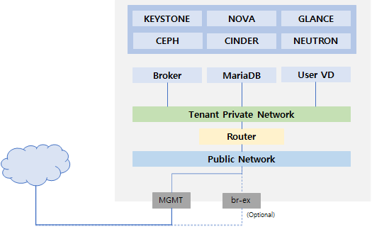
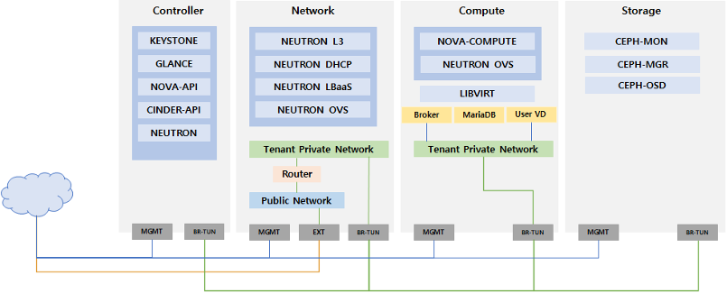
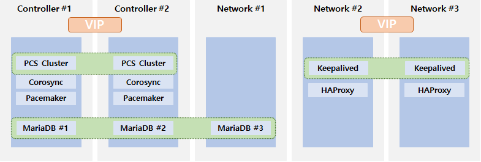
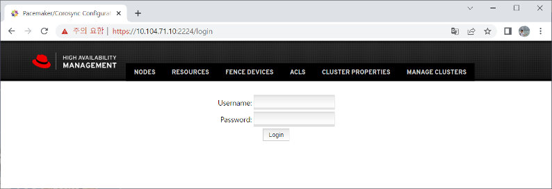
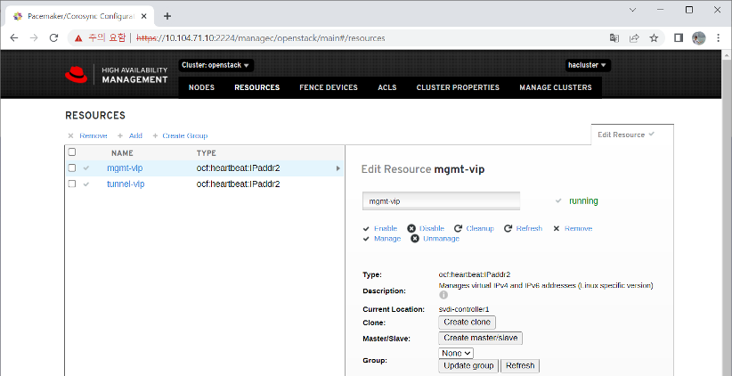
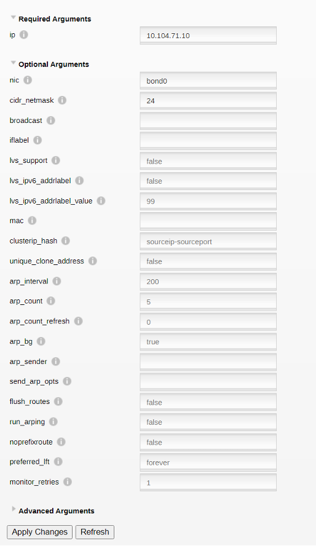
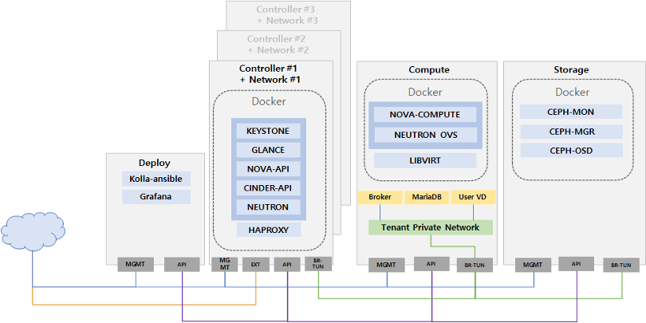
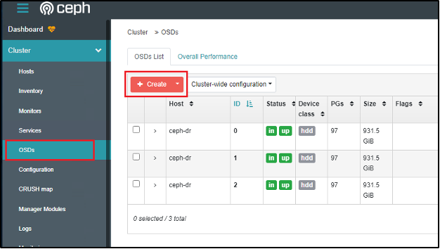
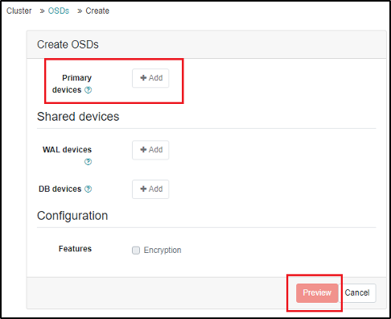
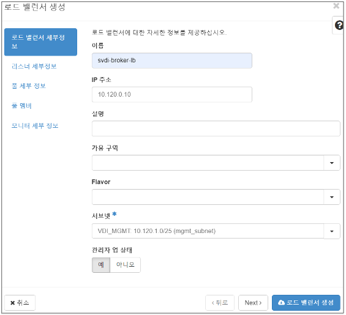

# **QUICK GUIDE Contents**

**Q1. 사용자가 특정 PostgreSQL DB로 접근하는 것을 차단하고 싶습니다.**

**Q2. 사용자가 PostgreSQL DB 내 'vip_info' 테이블 접근 시 차단하고
싶습니다.**

**Q3. 사용자가 PostgreSQL DB 내 'social number' 컬럼에 접근 시 차단하고
싶습니다.**

**Q4. 주민등록번호 10건 이상 조회 시 차단하고 싶습니다.**

**Q5. 지난달(ex. 2020.02.01\~2020.02.29) 동안 주민등록번호 10건 이상
조회된 쿼리와**

**쿼리결과값을 조회하고 싶습니다.**

**Q6. 지난달(ex. 2020.02.01\~2020.02.29) 동안 (쿼리 수, 매칭된 패턴 수를
기준으로)**

**주민등록번호를 가장 많이 조회한 사용자를 리포팅하고 싶습니다.**

{width="4.3125in"
height="1.6041666666666667in"}{width="4.3125in"
height="1.6041666666666667in"}{width="4.3125in"
height="1.6041666666666667in"}{width="4.3125in"
height="1.6041666666666667in"}1. **REPORTS \> Database \> 사용자
순위**를 클릭합니다.

{width="0.4527777777777778in"
height="0.20833333333333334in"}2. 사용자 순위 필터에서 버튼을 클릭하고
아래 **패턴 이름**과 **순위 선정 기준**을 선택한 후

> {width="0.4951388888888889in"
> height="0.20833333333333334in"} 을 클릭합니다. (\* 아래 이미지는
> ['패턴 개수'를 순위 선정 기준]{.underline}으로 선택한 경우입니다.)

-   **패턴 이름** : **주민 등록 번호**

-   **순위 선정 기준** : ① 쿼리 수 기준 → **SQL 개수** 선택

> ② 매칭된 패턴 수 기준 → **패턴 개수** 선택

{width="6.653472222222222in" height="1.13125in"}

{width="6.653472222222222in"
height="0.93082239720035in"}{width="6.653472222222222in"
height="0.93082239720035in"}{width="6.653472222222222in"
height="0.93082239720035in"}{width="6.653472222222222in"
height="0.93082239720035in"}{width="6.653472222222222in"
height="0.93082239720035in"}{width="6.653472222222222in"
height="0.93082239720035in"}{width="6.653472222222222in"
height="0.93082239720035in"}{width="6.653472222222222in"
height="0.93082239720035in"}{width="6.653472222222222in"
height="0.93082239720035in"}{width="6.653472222222222in"
height="0.93082239720035in"}3. 다음은 [(매칭된 패턴 수를 기준으로)
주민등록번호를 가장 많이 조회한 사용자]{.underline}에 대한
검색결과입니다.

+----------+---------------+-------------------------------------------+
| **메     | **서브        | **기 능**                                 |
| 뉴**     | 메뉴1**       |                                           |
+==========+===============+===========================================+
| **접근   | 세션 로그     | 세션을 기준으로 세션정보 및 세부 SQL문    |
| 통제**   |               | 검색                                      |
+----------+---------------+-------------------------------------------+
|          | SQL 로그      | 개별적인 쿼리 및 결과값 검색              |
+----------+---------------+-------------------------------------------+
|          | T             | Telnet/FTP/RDP 서버 상의 개인정보 조회 및 |
|          | elnet/FTP/RDP |                                           |
|          | 로그          | 파일 다운로드 이력 검색                   |
+----------+---------------+-------------------------------------------+
| **PC     | 검 사         | 개인정보 파일 패턴 검사                   |
| 통제**   |               |                                           |
+----------+---------------+-------------------------------------------+
|          | 유출 통제     | 개인정보 반출 허용/차단에 대한 로그 조회  |
+----------+---------------+-------------------------------------------+
