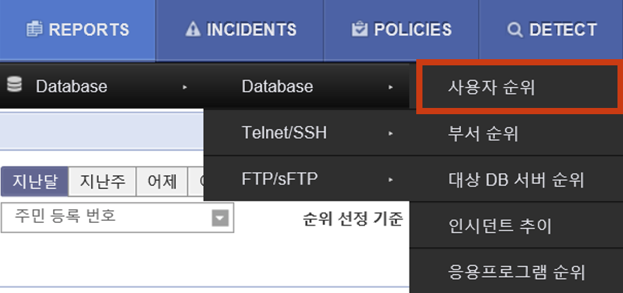
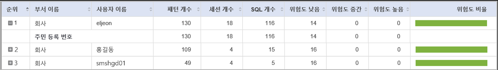

---
substitutions:
  image01: |-

  image02: |-
   
  image03: |-
    
  image04: |-
    
  image05: |-
    
---

# **QUICK GUIDE Contents**

### Q1. 사용자가 특정 PostgreSQL DB로 접근하는 것을 차단하고 싶습니다.
### Q2. 사용자가 PostgreSQL DB 내 ‘vip_info’ 테이블 접근 시 차단하고 싶습니다.
### Q3. 사용자가 PostgreSQL DB 내 ‘social number’ 컬럼에 접근 시 차단하고 싶습니다.
### Q4. 주민등록번호 10건 이상 조회 시 차단하고 싶습니다.
### Q5. 지난달(ex. 2020.02.01~2020.02.29) 동안 주민등록번호 10건 이상조회된 **쿼리**와 **쿼리결과값을 조회하고 싶습니다.**
### Q6. 지난달(ex. 2020.02.01~2020.02.29) 동안 (쿼리 수, 매칭된 패턴 수를 기준으로) **주민등록번호를 가장 많이 조회한 사용자**를 리포팅하고 싶습니다.  
  
  
### 1. **REPORTS > Database > 사용자 순위**를 클릭합니다.  

% 
```{image} _static/image01.png
:height: 1.87514in
:width: 3.97917in
```
### 2. 사용자 순위 필터에서 
% 
```{image} _static/image02.png
:height: 0.20833in
:width: 0.45278in
```
버튼을 클릭하고 아래 **패턴 이름**과 **순위 선정 기준**을 선택한 후
% 
```{image} _static/image03.png
:height: 0.20833in
:width: 0.49514in
```
을 클릭합니다.  
(\* 아래 이미지는 ‘패턴 개수’를 순위 선정 기준으로 선택한 경우입니다.)  

- **패턴 이름** : **주민 등록 번호**  
- **순위 선정 기준** :  
① 쿼리 수 기준 → **SQL 개수** 선택  
② 매칭된 패턴 수 기준 → **패턴 개수** 선택  

% 
```{image} _static/image04.png
:height: 1.16389in
:width: 6.77222in
```

### 3. 다음은 (매칭된 패턴 수를 기준으로) 주민등록번호를 가장 많이 조회한 사용자에 대한 검색결과입니다.

% 
```{image} _static/image05.png
:height: 0.96736in
:width: 6.77222in
```

| **메 뉴**   | **서브 메뉴1**         | **기 능**                                     |
| --------- | ------------------ | ------------------------------------------- |
| **접근 통제** | 세션 로그              | 세션을 기준으로 세션정보 및 세부 SQL문 검색                  |
|           | SQL 로그             | 개별적인 쿼리 및 결과값 검색                            |
|           | Telnet/FTP/RDP 로그 | Telnet/FTP/RDP 서버 상의 개인정보 조회 및파일 다운로드 이력 검색 |
| **PC 통제** | 검 사                | 개인정보 파일 패턴 검사                               |
|           | 유출 통제              | 개인정보 반출 허용/차단에 대한 로그 조회                     |
