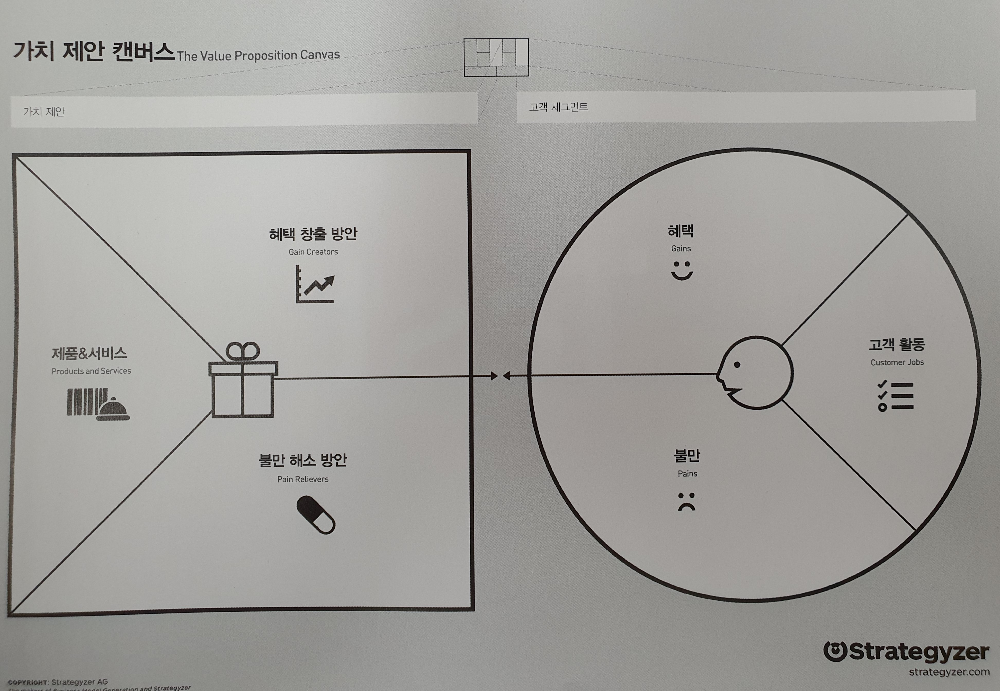

# 밸류 프로포지션 디자인
## 가치 제안 설계
Value Proposition Design

이 책을 보기 전에 비즈니스 모델의 탄생(비즈니스 모델 제너레이션)을 먼저 보고 비즈니스 모델 캔버스를 익히는 것이 올바른 순서이다.

### 1.비즈니스 모델의 탄생

비즈니스 모델을 구성하는 캔버스: 사업모델을 한 장으로 가시화하는 방법. 
가치 제안과 고객 채널을 포함하고 있다

사양한 업종의 Business Model Generation BMG 캔버스 모음집

### 비즈니스 모델 제너레이션 워크북

비즈니스 모델 제너레이션(BMG) 캔버스 작성을 위한 지침서 BMG캔버스 예제 포함

### 2. 밸류 프로포지션 디자인(가치 제안 설계)

**가치를 창출하는 패턴을 이해하라. 명확히**

**고객이 원하는 것을 설계하고, 테스트한 후 제공하라.**

1. 고객이 하고 있는, 해야 하는 활동이나 업무를 지원하는가? → "활동의 중요도 측정 필요" 중요하다? 아니다? ⇒ 의무기업의 인증획득과 유지는 중요하다.
2. 고객이 가진 불편이나 불만을 해소할수 있는가? → "불만의 극심 정도" 극심하다? 견딜만하다 ⇒ 업무부담이 크다. 컨설팅 등 비용이 많이 들고 준비와 수검, 결함조치에 많은 시간이 소요됨. 보안부서의 1년 농사. 
- 취약점 진단이 반드시 필요하다. ref. 주요통신기반시설 취약점 진단 가이드
- 외부전문가 포함된 보안감사가 반드시 필요하다. 외부인 감사 필요
- 매년 컨설팅 회사를 선정하는 절차를 거쳐야 한다. → 3년주기로 제안
3. 고객이 추구하는 것, 좋아하는 것, 고객에게 혜택이 돌아가는가? "혜택의 중요도" 필수적이다. 있으면 좋다 ⇒ 일상 업무(월간업무와 연중업무)를 통해 인증을 위한 증적이 자동으로 확보되는 것이 필요하다(최초, 사후, 갱신)

 

## 순서

## 1.캔버스

1.1 고객 프로필

1.2 가치 맵

1.3 적합성

## 2.디자인

2.1 가능성 프로토타이핑

2.2 출발점

2.3 고객 이해하기

2.4 선택하기

2.5 적합한 비즈니스 모델 찾기

2.6 기존 조직내 설계 활동

## 3.테스트

3.1 무엇을 테스트 할 것인가

3.2 단계별 테스트하기

3.3 실험 라이브러리

3.4 종합하기

## 4.진화 .Evolve

조화시키기

측정하고 모니터링하라

맹렬히 개선하라

자신을 끊임없이 재창조하라

타오바오(Taobao): e-커머스의 재창조

### 온라인 트레이닝 코스

[Strategyzer | Log in](https://platform.strategyzer.com/training)

가치 제안 설계의 핵심은 고객이 원하는 가치를 제안하기 위해
다양한 조사 활동에 검증된 도구를 적용하고, 
조사후에도 고객이 원하는 것과 가치 제안을 지속적으로 일치시키는 것이다.
The heart of Value Proposition Design is 
about applying Tools to the messy Search for value propositions that customers want 
and then keeping them aligned with what customers want in Post search

**가치 제안 설계**는 고객이 원하는 것을 반복 조사하면서 훌륭한 
가치 제안을 **디자인**하고 **테스트**하는데 
**가치 제안 캔버스**를 어떻게 사용하면 되는지 알려준다. 지속적인 가치 제안 설계 활동을 통해 고객에게 중요한 의미를 가지는 제안들을 계속 진화시켜나간다.

### 캔버스 ⇒ 설계/테스트 ⇒ 진화

**환경지도(Environment Map)**는 사업환경을 이해하는데 도움이 된다.

**비즈니스 모델 캔버스**는 사업에 맞는 가치를 창출하는데 도움이 된다.

**가치 제안 캔버스**는 고객에게 맞는 가치를 창출하는데 도움이 된다.
